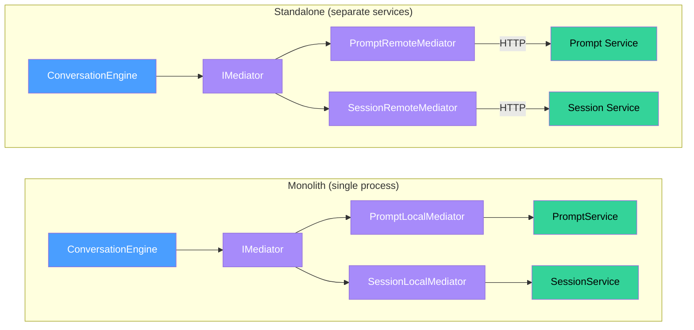

# Conversation -- Setup

How to register the Conversation domain module and wire its mediator client for monolith or standalone deployment.

## App Module

The Conversation domain has two module factories. Both accept a `ConversationMiddlewareConfig` to attach middleware to individual routes.

### Monolith

All domains run in one process. Prompt and session calls stay in-process through their local mediators.

```typescript
import { ConversationAppModule } from '@sanamyvn/ai-ts/app/conversation/module';

ConversationAppModule.forMonolith({
  middleware: {
    create: [authMiddleware],
    sendMessage: [authMiddleware],
    streamMessage: [authMiddleware],
  },
});
```

### Standalone

The prompt and session services run as separate deployments. Pass their URLs so the conversation module can reach them over HTTP.

```typescript
import { ConversationAppModule } from '@sanamyvn/ai-ts/app/conversation/module';

ConversationAppModule.forStandalone({
  middleware: {
    create: [authMiddleware],
    sendMessage: [authMiddleware],
    streamMessage: [authMiddleware],
  },
  promptServiceUrl: 'https://prompt.internal',
  sessionServiceUrl: 'https://session.internal',
});
```

Every key in the middleware config is optional. Omitted keys apply no middleware to that route.

## Mediator Client

The mediator client decouples the `ConversationAppService` from the business-layer `ConversationEngine`. Choose one provider function based on your deployment topology.

### Monolith

The local mediator calls `ConversationEngine` directly through the DI container.

```typescript
import { conversationClientMonolithProviders } from '@sanamyvn/ai-ts/app/conversation-client/module';

const conversationClient = conversationClientMonolithProviders();
// Spread into your module:
// providers: [...conversationClient.providers]
// exports:   [...conversationClient.exports]
```

### Standalone

The remote mediator forwards calls over HTTP to a separate conversation service.

```typescript
import { conversationClientStandaloneProviders } from '@sanamyvn/ai-ts/app/conversation-client/module';

const conversationClient = conversationClientStandaloneProviders({
  baseUrl: 'https://ai.example.com',
  httpClientToken: MY_HTTP_CLIENT,
});
// Spread into your module:
// providers: [...conversationClient.providers]
// exports:   [...conversationClient.exports]
```

`httpClientToken` must resolve to an object with `get` and `post` methods. See the `HttpClient` interface in `conversation-remote.mediator.ts` for the full contract.

## Required Tokens

| Token                            | Type                           | Who Provides                                 |
| -------------------------------- | ------------------------------ | -------------------------------------------- |
| `AI_MEDIATOR`                    | `IMediator`                    | Downstream app (foundation mediator)         |
| `AI_CONFIG`                      | `AiConfig`                     | Downstream app (must include `defaultModel`) |
| `MASTRA_AGENT`                   | `IMastraAgent`                 | Downstream app (Mastra integration)          |
| `CONVERSATION_MIDDLEWARE_CONFIG` | `ConversationMiddlewareConfig` | Auto-bound by `ConversationAppModule`        |

`AI_MEDIATOR`, `AI_CONFIG`, and `MASTRA_AGENT` are the tokens your application must bind. The module handles the rest.

## Deployment Comparison



**Blue** -- conversation engine (orchestrator). **Purple** -- mediator layer (transport abstraction). **Green** -- domain services (prompt, session).

In monolith mode, the mediator routes `ResolvePromptQuery` and `CreateSessionCommand` to in-process handlers. In standalone mode, remote mediators forward those same messages over HTTP to their respective services.
