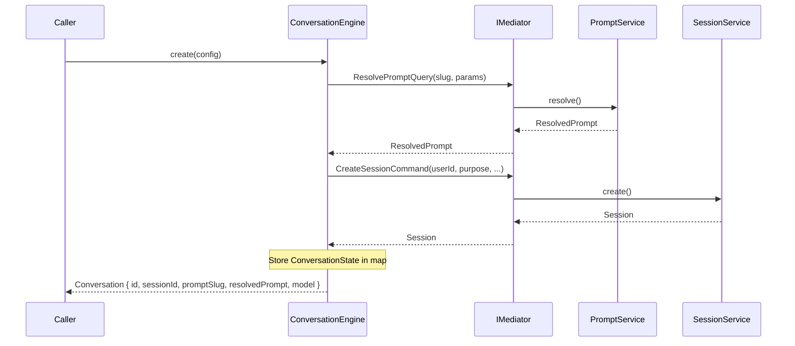
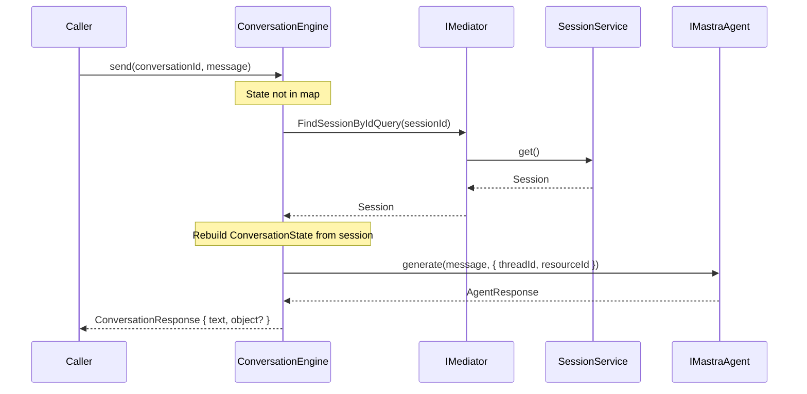

# Conversation -- Usage

How to create conversations, send messages, stream responses, and handle errors. The `ConversationEngine` orchestrates prompts, sessions, and the Mastra agent -- you interact with a single interface.

## Create a Conversation

```typescript
import type { IConversationEngine } from '@sanamyvn/ai-ts/business/conversation';
import { CONVERSATION_ENGINE } from '@sanamyvn/ai-ts/business/conversation';

const engine = container.resolve<IConversationEngine>(CONVERSATION_ENGINE);

const conversation = await engine.create({
  promptSlug: 'ielts-speaking-examiner',
  promptParams: { part: 2, topic: 'describe a place' },
  userId: 'student-1',
  purpose: 'ielts-speaking',
});
// conversation.id            -> session ID (used for send/stream)
// conversation.sessionId     -> same as id
// conversation.promptSlug    -> 'ielts-speaking-examiner'
// conversation.resolvedPrompt -> rendered prompt text
// conversation.model          -> resolved model name
```

### ConversationConfig Fields

| Field | Type | Required | Description |
|-------|------|----------|-------------|
| `promptSlug` | `string` | Yes | Slug of the prompt template to resolve |
| `promptParams` | `Record<string, unknown>` | Yes | Parameters passed to the prompt template |
| `userId` | `string` | Yes | User who owns the conversation |
| `tenantId` | `string` | No | Tenant for multi-tenant deployments |
| `purpose` | `string` | Yes | Label describing the conversation's intent |
| `model` | `string` | No | Override the default model from `AiConfig` |
| `outputSchema` | `unknown` | No | Schema for structured output from the agent |

### Orchestration Flow

`create()` resolves the prompt template, starts a session, and stores the conversation state in memory.



## Send a Message

```typescript
const response = await engine.send(conversation.id, 'Help me with Part 2');
// response.text   -> the agent's reply
// response.object -> structured output (present when outputSchema was set)
```

`send()` delegates to the Mastra agent's `generate()` method, passing the session's `mastraThreadId` so the agent maintains conversation history.

## Stream a Response

```typescript
for await (const chunk of engine.stream(conversation.id, 'Begin the test')) {
  // chunk.type:    'text-delta' | 'tool-call' | 'finish'
  // chunk.content: the chunk payload
}
```

`stream()` delegates to the Mastra agent's `stream()` method. Each `StreamChunk` carries a `type` discriminator and a `content` string.

## Multi-Instance Reconstruction

`ConversationState` lives in memory. When a different instance receives `send()` or `stream()` for a conversation it did not create, the engine reconstructs the state automatically:

1. Load the session from the session store via `FindSessionByIdQuery`.
2. Rebuild `ConversationState` from the session's persisted fields (`promptSlug`, `resolvedPrompt`, `mastraThreadId`, `userId`).
3. Cache the state and proceed with the agent call.

No sticky sessions are required. Any instance can handle any conversation.



## Error Handling

All errors extend `ConversationError`. Import them from `@sanamyvn/ai-ts/business/conversation/error`.

| Error | When | Type Guard |
|-------|------|------------|
| `ConversationNotFoundError` | Session lookup fails during reconstruction | `isConversationNotFoundError()` |
| `ConversationSendError` | Mastra agent fails (wraps `MastraAdapterError`) | `isConversationSendError()` |

```typescript
import {
  isConversationNotFoundError,
  isConversationSendError,
} from '@sanamyvn/ai-ts/business/conversation/error';

try {
  await engine.send('nonexistent-id', 'hello');
} catch (error) {
  if (isConversationNotFoundError(error)) {
    // error.conversationId contains the ID that was not found
  }
  if (isConversationSendError(error)) {
    // error.conversationId + error.cause (the underlying MastraAdapterError)
  }
}
```
