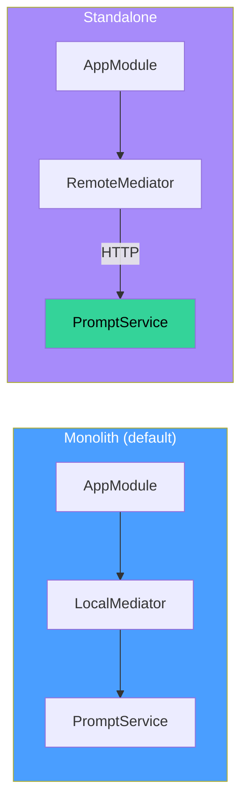

# Customization

This guide covers the extension points in `@sanamyvn/ai-ts`: deployment modes, middleware, custom repositories, and Mastra integration. Each section shows how to replace a default implementation without changing business code.

## Deployment Modes

The mediator client layer decouples domain modules from their transport. Swap between in-process calls and HTTP calls by changing one provider function per domain.



Both modes expose identical interfaces to the rest of the application. Business code never knows which transport is active.

### Monolith (default)

All domains run in one process. Each `*ClientMonolithProviders()` function registers a `LocalMediator` that calls the target service directly through the DI container.

```typescript
import { promptClientMonolithProviders } from '@sanamyvn/ai-ts/app/prompt-client/module';
import { sessionClientMonolithProviders } from '@sanamyvn/ai-ts/app/session-client/module';
import { conversationClientMonolithProviders } from '@sanamyvn/ai-ts/app/conversation-client/module';

const promptClient = promptClientMonolithProviders();
const sessionClient = sessionClientMonolithProviders();
const conversationClient = conversationClientMonolithProviders();

// Spread into your module definition:
// providers: [...promptClient.providers, ...sessionClient.providers, ...conversationClient.providers]
// exports:   [...promptClient.exports,   ...sessionClient.exports,   ...conversationClient.exports]
```

### Standalone

Domains run as separate services. Each `*ClientStandaloneProviders()` function registers a `RemoteMediator` that routes calls over HTTP.

```typescript
import { promptClientStandaloneProviders } from '@sanamyvn/ai-ts/app/prompt-client/module';
import { sessionClientStandaloneProviders } from '@sanamyvn/ai-ts/app/session-client/module';
import { conversationClientStandaloneProviders } from '@sanamyvn/ai-ts/app/conversation-client/module';

const promptClient = promptClientStandaloneProviders({
  baseUrl: 'https://prompt.example.com',
  httpClientToken: MY_HTTP_CLIENT,
});
const sessionClient = sessionClientStandaloneProviders({
  baseUrl: 'https://session.example.com',
  httpClientToken: MY_HTTP_CLIENT,
});
const conversationClient = conversationClientStandaloneProviders({
  baseUrl: 'https://conversation.example.com',
  httpClientToken: MY_HTTP_CLIENT,
});
```

Both `baseUrl` (the remote service origin) and `httpClientToken` (a DI token resolving to your HTTP client) are required. The `httpClientToken` must implement the `HttpClient` interface exported by each remote mediator module.

Business code, middleware, and repository bindings stay the same. Only the module composition changes.

## Custom Middleware

Each domain module accepts a `middleware` config that maps route names to arrays of middleware. Pass middleware through the module's `forRoot()` or `forMonolith()` method.

### PromptMiddlewareConfig

| Route             | Operation                  |
| ----------------- | -------------------------- |
| `create`          | Create a prompt            |
| `list`            | List prompts               |
| `getBySlug`       | Get prompt by slug         |
| `update`          | Update a prompt            |
| `createVersion`   | Create a prompt version    |
| `activateVersion` | Activate a prompt version  |
| `listVersions`    | List versions for a prompt |

### SessionMiddlewareConfig

| Route              | Operation                 |
| ------------------ | ------------------------- |
| `list`             | List sessions             |
| `get`              | Get session by ID         |
| `getMessages`      | Get session messages      |
| `exportTranscript` | Export session transcript |
| `end`              | End a session             |

### ConversationMiddlewareConfig

| Route           | Operation             |
| --------------- | --------------------- |
| `create`        | Create a conversation |
| `sendMessage`   | Send a message        |
| `streamMessage` | Stream a message      |

### Example: iam-ts auth middleware

Apply a single auth middleware to every route:

```typescript
import { PromptAppModule } from '@sanamyvn/ai-ts/app/prompt/module';
import { AuthMiddleware } from '@backend/app/middleware/auth.middleware';

PromptAppModule.forRoot({
  middleware: {
    create: [AuthMiddleware],
    list: [AuthMiddleware],
    getBySlug: [AuthMiddleware],
    update: [AuthMiddleware],
    createVersion: [AuthMiddleware],
    activateVersion: [AuthMiddleware],
    listVersions: [AuthMiddleware],
  },
});
```

### Example: Supabase auth middleware

Guard write routes with Supabase JWT verification, leave read routes open:

```typescript
import { SessionAppModule } from '@sanamyvn/ai-ts/app/session/module';
import { SupabaseAuthMiddleware } from '@backend/app/middleware/supabase-auth.middleware';

SessionAppModule.forRoot({
  middleware: {
    list: [],
    get: [],
    getMessages: [],
    exportTranscript: [SupabaseAuthMiddleware],
    end: [SupabaseAuthMiddleware],
  },
});
```

Omit a route key or pass an empty array to register that route without middleware.

## Custom Repositories

The default repositories use Drizzle with PostgreSQL. Replace any of them by implementing the interface and binding your class to the corresponding token.

### Repository interfaces

| Token                       | Interface                  | Methods                                                                                       |
| --------------------------- | -------------------------- | --------------------------------------------------------------------------------------------- |
| `PROMPT_REPOSITORY`         | `IPromptRepository`        | `create`, `findById`, `findBySlug`, `list`, `update`, `delete`                                |
| `PROMPT_VERSION_REPOSITORY` | `IPromptVersionRepository` | `create`, `findById`, `findActiveByPromptId`, `listByPromptId`, `setActive`, `getNextVersion` |
| `SESSION_REPOSITORY`        | `ISessionRepository`       | `create`, `findById`, `list`, `updateStatus`                                                  |

### Binding a custom repository

```typescript
import { bind } from '@sanamyvn/foundation/di/node/providers';
import { PROMPT_REPOSITORY } from '@sanamyvn/ai-ts/repository/prompt';
import type { IPromptRepository } from '@sanamyvn/ai-ts/repository/prompt';
import { MyCustomPromptRepo } from './my-custom-prompt-repo';

// In your module providers:
bind(PROMPT_REPOSITORY, MyCustomPromptRepo);
```

Your class must satisfy every method on the interface. The business layer calls these methods through the token -- it never imports a concrete repository class.

The same pattern applies to `PROMPT_VERSION_REPOSITORY` and `SESSION_REPOSITORY`:

```typescript
import { bind } from '@sanamyvn/foundation/di/node/providers';
import { PROMPT_VERSION_REPOSITORY } from '@sanamyvn/ai-ts/repository/prompt-version';
import { SESSION_REPOSITORY } from '@sanamyvn/ai-ts/repository/session';

bind(PROMPT_VERSION_REPOSITORY, MyCustomPromptVersionRepo);
bind(SESSION_REPOSITORY, MyCustomSessionRepo);
```

## Custom Mastra Integration

The default Mastra adapters wrap `@mastra/core` instances (`Agent`, `MastraMemory`) behind two interfaces: `IMastraAgent` and `IMastraMemory`. You can bypass the adapters entirely by implementing these interfaces yourself.

### IMastraAgent

```typescript
interface IMastraAgent {
  generate(prompt: string, options?: GenerateOptions): Promise<AgentResponse>;
  stream(prompt: string, options?: GenerateOptions): AsyncIterable<StreamChunk>;
}
```

### IMastraMemory

```typescript
interface IMastraMemory {
  createThread(resourceId: string): Promise<Thread>;
  getMessages(threadId: string, pagination: Pagination): Promise<MessageList>;
  listThreads(filter?: ThreadFilter): Promise<Thread[]>;
}
```

### Binding custom implementations

```typescript
import { bind } from '@sanamyvn/foundation/di/node/providers';
import { MASTRA_AGENT, MASTRA_MEMORY } from '@sanamyvn/ai-ts/business/mastra';
import type { IMastraAgent, IMastraMemory } from '@sanamyvn/ai-ts/business/mastra';
import { MyCustomAgent } from './my-custom-agent';
import { MyCustomMemory } from './my-custom-memory';

bind(MASTRA_AGENT, MyCustomAgent);
bind(MASTRA_MEMORY, MyCustomMemory);
```

When you bind directly to `MASTRA_AGENT` or `MASTRA_MEMORY`, the default adapters and their `MASTRA_CORE_AGENT` / `MASTRA_CORE_MEMORY` dependencies are no longer needed. You can drop the `@mastra/core` tokens from your module entirely.

Use cases for custom implementations:

- **Custom agent with tools** -- wire in domain-specific tool calls, retrieval-augmented generation, or multi-step agent pipelines that the default adapter does not support.
- **Alternative memory backend** -- store conversation history in Redis, DynamoDB, or any other store instead of Mastra's built-in memory.
- **Testing** -- inject a stub agent that returns deterministic responses without calling an LLM.
