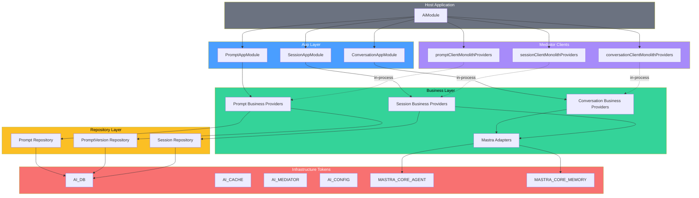

# Integration Guide

This guide walks through wiring `@sanamyvn/ai-ts` into a downstream application. It assumes you already use foundation DI and mediator patterns.

The package has three domains -- prompt, session, and conversation -- each with app, business, and repository layers. Your job is to provide infrastructure (database, cache, Mastra agent) and register the modules.

## Project Structure

A typical `src/` layout with AI module imports alongside your own app modules:

```
your-app/
├── src/
│   ├── foundation/
│   │   ├── database/
│   │   │   ├── database.module.ts    # DbModule — wraps PostgresModule
│   │   │   └── schema.ts            # Aggregates all Drizzle schemas (yours + AI's)
│   │   ├── cache.module.ts           # CacheModule — wraps Foundation CacheModule
│   │   └── mediator.module.ts        # MediatorModule — wraps Foundation MediatorModule
│   │
│   ├── ai/
│   │   ├── ai.module.ts             # AiModule — registers all three AI app modules
│   │   ├── ai-client.module.ts      # AiClientModule — monolith mediator adapters
│   │   └── mastra.module.ts         # MastraModule — provides agent + memory tokens
│   │
│   └── app/
│       └── domain/
│           └── ...                   # Your own app modules
```

## Database Setup

`@sanamyvn/ai-ts` expects a `PostgresClient<AiSchema>` bound to the `AI_DB` token. You have two options.

### Option A: Shared database (alias)

If your app and the AI module share the same Postgres instance, alias your existing database token:

```typescript
import { alias } from '@sanamyvn/foundation/di/core/providers';
import { AI_DB } from '@sanamyvn/ai-ts/shared/tokens';
import { DB } from '@backend/foundation/database/database.module';

// In your module providers:
alias(AI_DB, DB);
```

### Option B: Separate database

If the AI tables live in a dedicated database, register a second `PostgresModule.forRoot()` and bind its token to `AI_DB`:

```typescript
import { value } from '@sanamyvn/foundation/di/core/providers';
import { AI_DB } from '@sanamyvn/ai-ts/shared/tokens';

// In your module providers:
value(AI_DB, myAiDatabaseClient);
```

### Drizzle Schema Aggregation

Add the AI table schemas to your schema aggregation file so Drizzle migrations pick them up:

```typescript
// src/foundation/database/schema.ts
export * from '@backend/repository/domain/project/project.schema';
export * from '@backend/repository/domain/task/task.schema';

// AI schemas
export { aiPrompts } from '@sanamyvn/ai-ts/repository/prompt/schema';
export { aiPromptVersions } from '@sanamyvn/ai-ts/repository/prompt-version/schema';
export { aiSessions } from '@sanamyvn/ai-ts/repository/session/schema';
```

These exports feed into `drizzle-kit` and your migration config. Without them, Drizzle won't generate migrations for the AI tables.

## Mastra Setup

The AI package wraps Mastra's `Agent` and `MastraMemory` behind adapter interfaces. You provide the raw Mastra instances through two tokens:

```typescript
import { value } from '@sanamyvn/foundation/di/core/providers';
import { MASTRA_CORE_AGENT, MASTRA_CORE_MEMORY } from '@sanamyvn/ai-ts/business/mastra';
import { myAgent } from '@backend/ai/agent';
import { myMemory } from '@backend/ai/memory';

// In your module providers:
value(MASTRA_CORE_AGENT, myAgent);
value(MASTRA_CORE_MEMORY, myMemory);
```

The package's internal adapters (`MastraAgentAdapter`, `MastraMemoryAdapter`) wrap these automatically through DI. You never import or instantiate the adapters directly.

## Module Registration

Register all three AI app modules plus infrastructure in a single root module. Each `forRoot()` / `forMonolith()` call accepts an optional `middleware` config that maps route names to middleware arrays.

```typescript
// src/ai/ai.module.ts
import { Module, type ModuleDefinition } from '@sanamyvn/foundation/di/node/module';
import { alias, value } from '@sanamyvn/foundation/di/core/providers';
import { AI_DB, AI_CACHE, AI_MEDIATOR } from '@sanamyvn/ai-ts/shared/tokens';
import { AI_CONFIG, aiConfigSchema } from '@sanamyvn/ai-ts/config';
import { MASTRA_CORE_AGENT, MASTRA_CORE_MEMORY } from '@sanamyvn/ai-ts/business/mastra';
import { PromptAppModule } from '@sanamyvn/ai-ts/app/prompt/module';
import { SessionAppModule } from '@sanamyvn/ai-ts/app/session/module';
import { ConversationAppModule } from '@sanamyvn/ai-ts/app/conversation/module';
import { promptClientMonolithProviders } from '@sanamyvn/ai-ts/app/prompt-client/module';
import { sessionClientMonolithProviders } from '@sanamyvn/ai-ts/app/session-client/module';
import { conversationClientMonolithProviders } from '@sanamyvn/ai-ts/app/conversation-client/module';
import { DB } from '@backend/foundation/database/database.module';
import { CACHE } from '@backend/foundation/cache.module';
import { MEDIATOR } from '@backend/foundation/mediator.module';
import { AuthMiddleware } from '@backend/app/middleware/auth.middleware';
import { myAgent } from '@backend/ai/agent';
import { myMemory } from '@backend/ai/memory';

export class AiModule extends Module {
  exports = [];

  static forRoot(): ModuleDefinition {
    const promptClient = promptClientMonolithProviders();
    const sessionClient = sessionClientMonolithProviders();
    const conversationClient = conversationClientMonolithProviders();

    return {
      module: AiModule,
      imports: [
        // Domain modules
        PromptAppModule.forRoot({
          middleware: {
            create: [AuthMiddleware],
            list: [AuthMiddleware],
            getBySlug: [AuthMiddleware],
            update: [AuthMiddleware],
            createVersion: [AuthMiddleware],
            activateVersion: [AuthMiddleware],
            listVersions: [AuthMiddleware],
          },
        }),
        SessionAppModule.forRoot({
          middleware: {
            list: [AuthMiddleware],
            get: [AuthMiddleware],
            getMessages: [AuthMiddleware],
            exportTranscript: [AuthMiddleware],
            end: [AuthMiddleware],
          },
        }),
        ConversationAppModule.forMonolith({
          middleware: {
            create: [AuthMiddleware],
            sendMessage: [AuthMiddleware],
            streamMessage: [AuthMiddleware],
          },
        }),
      ],
      providers: [
        // Infrastructure tokens
        alias(AI_DB, DB),
        alias(AI_CACHE, CACHE),
        alias(AI_MEDIATOR, MEDIATOR),
        value(AI_CONFIG, aiConfigSchema.parse({})),
        value(MASTRA_CORE_AGENT, myAgent),
        value(MASTRA_CORE_MEMORY, myMemory),

        // Mediator client adapters
        ...promptClient.providers,
        ...sessionClient.providers,
        ...conversationClient.providers,
      ],
      exports: [...promptClient.exports, ...sessionClient.exports, ...conversationClient.exports],
    };
  }
}
```

### Middleware Config Reference

Each domain exposes a typed config that maps route names to middleware arrays:

| Domain       | Method                                | Routes                                                                                      |
| ------------ | ------------------------------------- | ------------------------------------------------------------------------------------------- |
| Prompt       | `PromptAppModule.forRoot()`           | `create`, `list`, `getBySlug`, `update`, `createVersion`, `activateVersion`, `listVersions` |
| Session      | `SessionAppModule.forRoot()`          | `list`, `get`, `getMessages`, `exportTranscript`, `end`                                     |
| Conversation | `ConversationAppModule.forMonolith()` | `create`, `sendMessage`, `streamMessage`                                                    |

Pass an empty object or omit `middleware` entirely to register routes without middleware.

## Mediator Client Wiring

The three `*ClientMonolithProviders()` functions register in-process mediator adapters. These let domains call each other without HTTP -- the conversation domain can look up prompts and sessions through the mediator instead of importing their services directly.

```typescript
import { promptClientMonolithProviders } from '@sanamyvn/ai-ts/app/prompt-client/module';
import { sessionClientMonolithProviders } from '@sanamyvn/ai-ts/app/session-client/module';
import { conversationClientMonolithProviders } from '@sanamyvn/ai-ts/app/conversation-client/module';

const promptClient = promptClientMonolithProviders();
const sessionClient = sessionClientMonolithProviders();
const conversationClient = conversationClientMonolithProviders();

// Spread into your module's providers and exports:
// providers: [...promptClient.providers, ...sessionClient.providers, ...conversationClient.providers]
// exports:   [...promptClient.exports,   ...sessionClient.exports,   ...conversationClient.exports]
```

Each function returns a `ProviderBundle` with `providers` and `exports` arrays. Spread both into your module definition.

For standalone (microservice) deployments, use the `*StandaloneProviders()` variants instead. These take a `baseUrl` and `httpClientToken` to route cross-domain calls over HTTP.

## Module Dependency Graph



The host application provides the infrastructure tokens (bottom row). Repository providers depend on `AI_DB`. Business providers depend on repositories and Mastra adapters. App modules depend on business providers. Mediator clients wire cross-domain calls through the in-process mediator.
