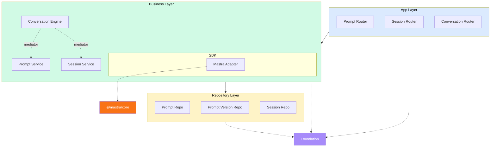
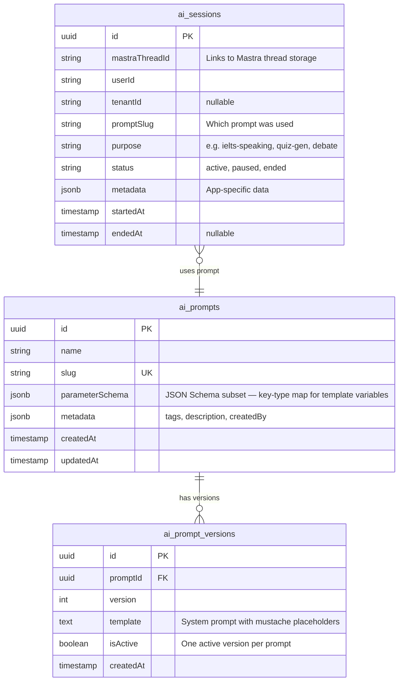
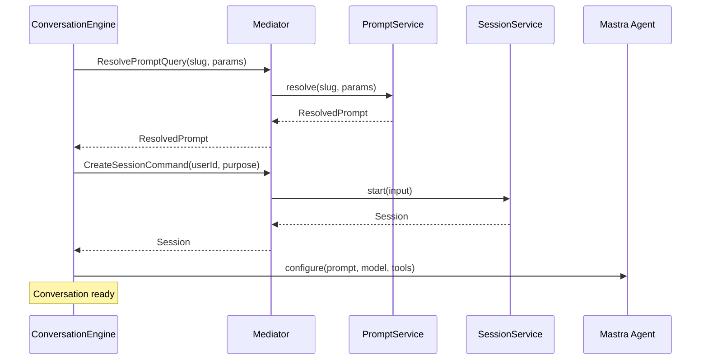

# AI Package Design

Package: `@sanamy/ai`

A layered package that wraps [Mastra](https://mastra.ai) behind stable interfaces and provides the shared primitives for building AI-powered products. Every AI feature — quiz generation, student debates, IELTS speaking tests, grading pipelines — follows one pattern: pick a persona, inject context, converse, optionally evaluate. This package codifies that pattern.

## Problem

Multiple products need AI features:

- **AI Teacher Assistant** — quiz generation, student debates with voice, topic chatbots, grading workflows
- **Simulated IELTS Test** — speaking practice with AI examiner, writing scoring, reading/listening test generation

Each product would otherwise build its own prompt management, session tracking, and conversation orchestration from scratch. The shared infrastructure belongs in a reusable package.

## Relationship to Mastra

Mastra provides the AI runtime. This package provides the application-level primitives Mastra lacks.

| Concern | Owner |
|---|---|
| Prompt registry (versioned, parameterized templates) | `@sanamy/ai` |
| Conversation engine (persona + context + session orchestration) | `@sanamy/ai` |
| Session lifecycle + metadata (who, why, status) | `@sanamy/ai` |
| Admin REST APIs (prompt CRUD, session viewing, transcript export) | `@sanamy/ai` |
| Auth guard interfaces (strategy pattern) | `@sanamy/ai` defines, downstream implements |
| Thread/message storage | Mastra (direct) |
| Voice (TTS/STT/real-time) | Mastra (direct) |
| RAG / context injection | Mastra (direct) |
| Structured output | Mastra (direct) |
| Evals / scoring | Mastra (direct) |
| Model routing / provider switching | Mastra (direct) |

Mastra is a third-party dependency wrapped in `business/sdk/mastra/`, the same way `iam-ts` wraps `jose` and `argon2`.

For advanced use cases, downstream apps use Mastra directly — no wrapper needed. The package handles the common pattern; Mastra handles the raw capabilities.

## Architecture

The package follows the [layered architecture](../architecture/layered-architecture.md) with three application layers plus foundation. Cross-domain communication uses the [mediator pattern](../architecture/mediator-patterns.md).



### Directory Structure

```
@sanamy/ai
├── src/
│   ├── shared/
│   │   └── tokens.ts                          # AI_DB, AI_CACHE, AI_MEDIATOR
│   │
│   ├── repository/
│   │   └── domain/
│   │       ├── prompt/
│   │       │   ├── prompt.interface.ts         # IPromptRepository
│   │       │   ├── prompt.schema.ts            # Drizzle: ai_prompts
│   │       │   ├── prompt.model.ts             # PromptRecord, NewPromptRecord
│   │       │   ├── prompt.db.ts                # DrizzlePromptRepository
│   │       │   ├── prompt.error.ts             # DuplicatePromptError
│   │       │   ├── prompt.providers.ts
│   │       │   └── prompt.testing.ts
│   │       │
│   │       ├── prompt-version/
│   │       │   ├── prompt-version.interface.ts # IPromptVersionRepository
│   │       │   ├── prompt-version.schema.ts    # Drizzle: ai_prompt_versions
│   │       │   ├── prompt-version.model.ts
│   │       │   ├── prompt-version.db.ts
│   │       │   ├── prompt-version.error.ts
│   │       │   ├── prompt-version.providers.ts
│   │       │   └── prompt-version.testing.ts
│   │       │
│   │       └── session/
│   │           ├── session.interface.ts        # ISessionRepository
│   │           ├── session.schema.ts           # Drizzle: ai_sessions
│   │           ├── session.model.ts
│   │           ├── session.db.ts
│   │           ├── session.error.ts
│   │           ├── session.providers.ts
│   │           └── session.testing.ts
│   │
│   ├── business/
│   │   ├── sdk/
│   │   │   └── mastra/
│   │   │       ├── mastra.interface.ts         # IMastraAgent, IMastraMemory
│   │   │       ├── adapters/
│   │   │       │   ├── mastra.agent.ts         # generate(), stream()
│   │   │       │   └── mastra.memory.ts        # getMessages(), listThreads()
│   │   │       ├── mastra.error.ts             # MastraAdapterError
│   │   │       ├── mastra.providers.ts
│   │   │       └── mastra.testing.ts
│   │   │
│   │   ├── domain/
│   │   │   ├── prompt/
│   │   │   │   ├── prompt.interface.ts         # IPromptService
│   │   │   │   ├── prompt.business.ts          # PromptService
│   │   │   │   ├── prompt.model.ts             # PromptTemplate, ResolvedPrompt
│   │   │   │   ├── prompt.error.ts
│   │   │   │   ├── prompt.mapper.ts
│   │   │   │   ├── prompt.providers.ts
│   │   │   │   ├── prompt.testing.ts
│   │   │   │   └── client/
│   │   │   │       ├── schemas.ts              # PromptClientModel
│   │   │   │       ├── queries.ts              # ResolvePromptQuery, ListPromptsQuery, CreatePromptCommand, CreateVersionCommand
│   │   │   │       ├── errors.ts               # PromptNotFoundClientError
│   │   │   │       └── mediator.ts             # IPromptMediator + PROMPT_MEDIATOR token
│   │   │   │
│   │   │   ├── session/
│   │   │   │   ├── session.interface.ts        # ISessionService
│   │   │   │   ├── session.business.ts         # SessionService
│   │   │   │   ├── session.model.ts            # Session, SessionWithMessages
│   │   │   │   ├── session.error.ts
│   │   │   │   ├── session.mapper.ts
│   │   │   │   ├── session.providers.ts
│   │   │   │   ├── session.testing.ts
│   │   │   │   └── client/
│   │   │   │       ├── schemas.ts
│   │   │   │       ├── queries.ts              # Queries and commands
│   │   │   │       ├── errors.ts
│   │   │   │       └── mediator.ts             # ISessionMediator + SESSION_MEDIATOR token
│   │   │   │
│   │   │   └── conversation/
│   │   │       ├── conversation.interface.ts   # IConversationEngine
│   │   │       ├── conversation.business.ts    # ConversationEngine
│   │   │       ├── conversation.model.ts       # ConversationConfig, ConversationResponse
│   │   │       ├── conversation.error.ts
│   │   │       ├── conversation.providers.ts
│   │   │       ├── conversation.testing.ts
│   │   │       └── client/
│   │   │           ├── schemas.ts
│   │   │           ├── queries.ts              # Queries and commands
│   │   │           ├── errors.ts
│   │   │           └── mediator.ts             # IConversationMediator + CONVERSATION_MEDIATOR token
│   │   │
│   │   └── providers.ts                        # aiBusinessProviders()
│   │
│   ├── app/
│   │   ├── domain/
│   │   │   ├── prompt/
│   │   │   │   ├── prompt.router.ts            # REST: /ai/prompts
│   │   │   │   ├── prompt.service.ts           # Error mapping
│   │   │   │   ├── prompt.dto.ts
│   │   │   │   ├── prompt.mapper.ts
│   │   │   │   ├── prompt.error.ts
│   │   │   │   ├── prompt.tokens.ts
│   │   │   │   ├── prompt.providers.ts
│   │   │   │   └── prompt.module.ts
│   │   │   │
│   │   │   ├── session/
│   │   │   │   ├── session.router.ts           # REST: /ai/sessions
│   │   │   │   ├── session.service.ts
│   │   │   │   ├── session.dto.ts
│   │   │   │   ├── session.mapper.ts
│   │   │   │   ├── session.error.ts
│   │   │   │   ├── session.tokens.ts
│   │   │   │   ├── session.providers.ts
│   │   │   │   └── session.module.ts
│   │   │   │
│   │   │   └── conversation/
│   │   │       ├── conversation.router.ts      # REST: /ai/conversations
│   │   │       ├── conversation.service.ts
│   │   │       ├── conversation.dto.ts
│   │   │       ├── conversation.mapper.ts
│   │   │       ├── conversation.error.ts
│   │   │       ├── conversation.tokens.ts
│   │   │       ├── conversation.providers.ts
│   │   │       └── conversation.module.ts
│   │   │
│   │   ├── sdk/
│   │   │   ├── prompt-client/
│   │   │   │   ├── prompt-local.mediator.ts
│   │   │   │   ├── prompt-remote.mediator.ts
│   │   │   │   ├── prompt-client.module.ts     # forMonolith() / forStandalone()
│   │   │   │   └── prompt.mapper.ts
│   │   │   │
│   │   │   ├── session-client/
│   │   │   │   ├── session-local.mediator.ts
│   │   │   │   ├── session-remote.mediator.ts
│   │   │   │   ├── session-client.module.ts
│   │   │   │   └── session.mapper.ts
│   │   │   │
│   │   │   └── conversation-client/
│   │   │       ├── conversation-local.mediator.ts
│   │   │       ├── conversation-remote.mediator.ts
│   │   │       ├── conversation-client.module.ts
│   │   │       └── conversation.mapper.ts
│   │   │
│   │   └── providers.ts                        # aiAppProviders()
│   │
│   ├── config.ts                                # aiConfigSchema + tokens
│   └── error.ts                                 # AiError base class
│
├── package.json
└── tsconfig.json
```

## Repository Layer

Stores what Mastra does not: prompt templates and session metadata. Mastra owns thread/message storage.

### Database Tables



The `ai_sessions` table is a lightweight envelope around Mastra's thread. Mastra owns the messages. This table adds business context: who started it, why, what prompt was used, and lifecycle state.

**Data flow for viewing conversations:**

1. Query `ai_sessions` — filter by tenant, user, purpose, status, date range
2. For a specific session, use its `mastraThreadId` to call Mastra's memory API for messages

The business layer joins both into a single `getWithMessages()` call.

### Shared Tokens

```typescript
// src/shared/tokens.ts
export const AI_DB = createToken<PostgresJsDatabase>('AI_DB');
export const AI_CACHE = createToken<ICache>('AI_CACHE');
export const AI_MEDIATOR = createToken<IMediator>('AI_MEDIATOR');
```

Downstream provides the database connection, same as `iam-ts`.

## Business Layer

### SDK: Mastra Adapter

Wraps Mastra behind stable interfaces so downstream code never imports `@mastra/core` directly for the operations this package manages. Catches all Mastra exceptions at the adapter boundary and wraps them in `MastraAdapterError`.

```typescript
// mastra.interface.ts
interface IMastraAgent {
  generate(prompt: string, options?: GenerateOptions): Promise<AgentResponse>;
  stream(prompt: string, options?: GenerateOptions): AsyncIterable<StreamChunk>;
}

interface IMastraMemory {
  createThread(resourceId: string): Promise<Thread>;
  getMessages(threadId: string, pagination: Pagination): Promise<MessageList>;
  listThreads(filter: ThreadFilter): Promise<Thread[]>;
}
```

For voice, RAG, structured output, and evals, downstream apps use Mastra directly. These capabilities are too varied and configuration-heavy to benefit from wrapping.

### Domain: Prompt Service

Manages versioned, parameterized system prompt templates stored in the database.

```typescript
interface IPromptService {
  create(input: CreatePromptInput): Promise<PromptTemplate>;
  getBySlug(slug: string): Promise<PromptTemplate>;
  list(filter: PromptFilter): Promise<PromptTemplate[]>;
  update(id: string, input: UpdatePromptInput): Promise<PromptTemplate>;

  createVersion(promptId: string, input: CreateVersionInput): Promise<PromptVersion>;
  listVersions(promptId: string): Promise<PromptVersion[]>;
  setActiveVersion(promptId: string, versionId: string): Promise<void>;

  resolve(slug: string, params: Record<string, unknown>): Promise<ResolvedPrompt>;
}
```

`resolve()` is the key method. It finds the active version of a prompt by slug, validates the provided parameters against the prompt's `parameterSchema`, renders the template, and returns a string ready to use as Mastra agent instructions.

A prompt template example:

```
slug: "ielts-speaking-examiner"
parameterSchema: { "part": { "type": "number", "min": 1, "max": 3 }, "topic": { "type": "string" } }
template: "You are an IELTS speaking examiner conducting Part {{part}}.
           The topic is: {{topic}}. Follow official IELTS format..."
```

`parameterSchema` is stored as a JSON Schema subset (key-type map with optional constraints). At resolve time, the service converts it to a Zod schema for validation. This avoids serializing Zod objects into the database.

### Domain: Session Service

Manages session lifecycle and message retrieval. Joins the `ai_sessions` table with Mastra's thread storage.

```typescript
interface ISessionService {
  start(input: StartSessionInput): Promise<Session>;
  pause(sessionId: string): Promise<void>;
  resume(sessionId: string): Promise<Session>;
  end(sessionId: string): Promise<void>;

  get(sessionId: string): Promise<Session>;
  list(filter: SessionFilter): Promise<SessionSummary[]>;
  getMessages(sessionId: string, pagination: Pagination): Promise<MessageList>;
  exportTranscript(sessionId: string, format: 'json' | 'text'): Promise<Transcript>;
}
```

`start()` creates both an `ai_sessions` row and a Mastra thread, linking them via `mastraThreadId`. `getMessages()` delegates to the Mastra adapter. `exportTranscript()` fetches all messages and formats them.

### Domain: Conversation Engine

The core orchestrator. Composes the prompt service, session service, and Mastra agent adapter into the shared pattern: persona + context + session + converse.

```typescript
interface IConversationEngine {
  create(config: ConversationConfig): Promise<Conversation>;
  send(conversationId: string, message: string): Promise<ConversationResponse>;
  stream(conversationId: string, message: string): AsyncIterable<StreamChunk>;
}

interface ConversationConfig {
  promptSlug: string;
  promptParams: Record<string, unknown>;
  userId: string;
  tenantId?: string;
  purpose: string;
  model?: string;                    // defaults from config schema
  outputSchema?: ZodSchema;          // for structured output (quiz JSON, rubric scores)
}
```

`ConversationConfig` contains no Mastra types. The Mastra adapter maps `outputSchema` to Mastra's `structuredOutput` internally. Voice configuration is an app-layer concern — downstream configures Mastra voice providers and passes them to the conversation endpoint, not through the business interface.

A `Conversation` is a runtime-only handle. It is not a persisted entity. It wraps a `Session` (persisted in `ai_sessions`) and a configured Mastra agent (in memory). `conversationId` maps 1:1 to `sessionId`. The `Conversation` type exists so the engine can track the agent configuration alongside the session reference without exposing internals.

**Multi-instance deployments:** The in-memory conversation handle may not exist on the instance that receives a subsequent `send()` or `stream()` request. When the handle is missing, the engine reconstructs it from persisted data: load the session row (which stores `promptSlug`), re-resolve the prompt via the mediator, and re-create the Mastra agent. The Mastra thread (message history) is already persisted. This means no sticky sessions are required — any instance can serve any request.

`create()` resolves the prompt via the mediator, creates a session via the mediator, and configures a Mastra agent. `send()` and `stream()` delegate to the agent and update session state.

```typescript
// conversation.business.ts — simplified
class ConversationEngine implements IConversationEngine {
  constructor(
    private mediator: IMediator,
    private mastra: IMastraAgent,
  ) {}

  async create(config: ConversationConfig): Promise<Conversation> {
    const prompt = await this.mediator.send(
      new ResolvePromptQuery({ slug: config.promptSlug, params: config.promptParams }),
    );

    const session = await this.mediator.send(
      new CreateSessionCommand({
        userId: config.userId,
        tenantId: config.tenantId,
        promptSlug: config.promptSlug,
        purpose: config.purpose,
      }),
    );

    // Configure Mastra agent with resolved prompt
    // Store conversation state for subsequent send()/stream() calls
    // ...
  }
}
```

### Cross-Domain Communication

All business-layer communication goes through the mediator. ConversationEngine never directly imports PromptService or SessionService. Each domain exposes a `client/` folder with mediator contracts.



Any domain can be extracted to its own service with a module swap (`forMonolith()` → `forStandalone()`), zero code changes in the business layer.

## App Layer

### REST Endpoints

**Prompt management** (`/ai/prompts`):

| Method | Path | Purpose |
|---|---|---|
| `POST` | `/ai/prompts` | Create a prompt template |
| `GET` | `/ai/prompts` | List prompts (filter by tag, search) |
| `GET` | `/ai/prompts/:slug` | Get prompt with active version |
| `PUT` | `/ai/prompts/:slug` | Update prompt metadata |
| `POST` | `/ai/prompts/:slug/versions` | Create a new version |
| `PUT` | `/ai/prompts/:slug/versions/:id/activate` | Set active version |
| `GET` | `/ai/prompts/:slug/versions` | List version history |

**Session management** (`/ai/sessions`):

| Method | Path | Purpose |
|---|---|---|
| `GET` | `/ai/sessions` | List sessions (filter by user, tenant, purpose, status, date range) |
| `GET` | `/ai/sessions/:id` | Get session metadata |
| `GET` | `/ai/sessions/:id/messages` | Get messages (paginated, via Mastra) |
| `GET` | `/ai/sessions/:id/transcript` | Export transcript (JSON or plain text) |
| `PUT` | `/ai/sessions/:id/end` | End a session |

**Conversation** (`/ai/conversations`):

| Method | Path | Purpose |
|---|---|---|
| `POST` | `/ai/conversations` | Create conversation (prompt slug + params + mode) |
| `POST` | `/ai/conversations/:id/messages` | Send a message, get response |
| `POST` | `/ai/conversations/:id/messages/stream` | Send a message, get SSE-streamed response |

Prompt and session endpoints serve the admin dashboard. Conversation endpoints are the runtime API downstream apps call.

### Mediator Client Modules

Each domain has local and remote mediator adapters, following the [mediator patterns](../architecture/mediator-patterns.md):

```
app/sdk/
├── prompt-client/
│   ├── prompt-local.mediator.ts       # Wraps PromptService in-process
│   ├── prompt-remote.mediator.ts      # HTTP calls to prompt service
│   ├── prompt-client.module.ts        # forMonolith() / forStandalone()
│   └── prompt.mapper.ts              # toClientModelFromBusiness / FromApp
│
├── session-client/                    # Same pattern
└── conversation-client/               # Same pattern
```

## Auth Model

Each app module accepts a `middleware` config in `forRoot()` with one entry per route operation. Downstream provides middleware arrays (authentication, role checks, resource-level authorization) per operation. The AI package applies them to the corresponding routes at registration time. No guard interfaces, no DI tokens — just configuration.

Middleware has full access to the request context, including path params, so it can load resources and check ownership before the handler runs.

```typescript
PromptAppModule.forRoot({
  middleware: {
    create: [AuthMiddleware, RoleMiddleware.require('admin')],
    list: [AuthMiddleware],
    getBySlug: [AuthMiddleware],
    update: [AuthMiddleware, PromptOwnerMiddleware],
    createVersion: [AuthMiddleware, PromptOwnerMiddleware],
    activateVersion: [AuthMiddleware, RoleMiddleware.require('admin')],
    listVersions: [AuthMiddleware],
  },
}),

SessionAppModule.forRoot({
  middleware: {
    list: [AuthMiddleware],
    get: [AuthMiddleware],
    getMessages: [AuthMiddleware, SessionOwnerOrAdminMiddleware],
    exportTranscript: [AuthMiddleware, RoleMiddleware.require('admin')],
    end: [AuthMiddleware, SessionOwnerMiddleware],
  },
}),

ConversationAppModule.forMonolith({
  middleware: {
    create: [AuthMiddleware],
    sendMessage: [AuthMiddleware, ConversationOwnerMiddleware],
    streamMessage: [AuthMiddleware, ConversationOwnerMiddleware],
  },
}),
```

The router applies middleware per-route:

```typescript
// Inside the AI package — prompt.router.ts
class PromptRouter implements IRouter {
  constructor(
    private service: PromptAppService,
    private config: PromptRouterConfig,
  ) {}

  register(app: IRouterBuilder): void {
    app.post('/')
      .middleware(...(this.config.middleware.create ?? []))
      .handle(/* ... */);

    app.get('/')
      .middleware(...(this.config.middleware.list ?? []))
      .handle(/* ... */);

    app.put('/:slug')
      .middleware(...(this.config.middleware.update ?? []))
      .handle(/* ... */);
  }
}
```

Downstream owns all auth logic. The AI package stays auth-agnostic — it only provides the hook points. Different apps wire different middleware stacks:

```typescript
// Teacher platform — uses iam-ts
PromptAppModule.forRoot({
  middleware: {
    create: [AuthMiddleware, RoleMiddleware.require('admin')],
    update: [AuthMiddleware, PromptOwnerMiddleware],
    // ...
  },
}),

// IELTS platform — uses Supabase
PromptAppModule.forRoot({
  middleware: {
    create: [SupabaseAuthMiddleware, AdminOnlyMiddleware],
    update: [SupabaseAuthMiddleware, AdminOnlyMiddleware],
    // ...
  },
}),
```

## Error Hierarchy

Each domain layer defines its own base error class. No package-wide base error — each feature owns its error hierarchy.

```
Repository:
  PromptRepositoryError (base)
  ├── DuplicatePromptError
  └── PromptNotFoundRepoError

  PromptVersionRepositoryError (base)
  └── PromptVersionNotFoundRepoError

  SessionRepositoryError (base)
  └── SessionNotFoundRepoError

Business:
  MastraAdapterError (base)           ← wraps all @mastra/core exceptions

  PromptError (base)
  ├── PromptNotFoundError             ← wraps PromptNotFoundRepoError
  ├── PromptAlreadyExistsError        ← wraps DuplicatePromptError
  ├── PromptVersionNotFoundError      ← wraps PromptVersionNotFoundRepoError
  ├── InvalidPromptParametersError    ← parameter validation failure
  └── PromptRenderError               ← template rendering failure

  SessionError (base)
  ├── SessionNotFoundError            ← wraps SessionNotFoundRepoError
  └── SessionAlreadyEndedError

  ConversationError (base)
  ├── ConversationNotFoundError
  └── ConversationSendError           ← wraps MastraAdapterError

Client (mediator contracts):
  PromptClientError (base)
  └── PromptNotFoundClientError

  SessionClientError (base)
  └── SessionNotFoundClientError

  ConversationClientError (base)
  └── ConversationNotFoundClientError
```

Error wrapping at each boundary:

```
Mastra SDK throws → MastraAdapterError (business/sdk boundary)
  → ConversationSendError (business domain catches adapter error)
    → HTTP 500 (app service maps business error)

Drizzle unique violation → DuplicatePromptError (repo boundary)
  → PromptAlreadyExistsError (business catches repo error)
    → ConflictError 409 (app maps business error)
```

## Downstream Wiring

### Monolith (all AI domains local)

```typescript
class AppModule extends Module {
  imports = [
    MediatorModule,
    // AI package modules with per-route middleware
    PromptAppModule.forRoot({
      middleware: {
        create: [AuthMiddleware, RoleMiddleware.require('admin')],
        list: [AuthMiddleware],
        getBySlug: [AuthMiddleware],
        update: [AuthMiddleware, PromptOwnerMiddleware],
        createVersion: [AuthMiddleware, PromptOwnerMiddleware],
        activateVersion: [AuthMiddleware, RoleMiddleware.require('admin')],
        listVersions: [AuthMiddleware],
      },
    }),
    SessionAppModule.forRoot({
      middleware: {
        list: [AuthMiddleware],
        get: [AuthMiddleware],
        getMessages: [AuthMiddleware, SessionOwnerOrAdminMiddleware],
        exportTranscript: [AuthMiddleware, RoleMiddleware.require('admin')],
        end: [AuthMiddleware, SessionOwnerMiddleware],
      },
    }),
    ConversationAppModule.forMonolith({
      middleware: {
        create: [AuthMiddleware],
        sendMessage: [AuthMiddleware],
        streamMessage: [AuthMiddleware],
      },
    }),

    // App's own features
    ClassroomAppModule.forMonolith(),
  ];
}
```

### Split services

```typescript
// Conversation as standalone service
class ConversationServiceModule extends Module {
  imports = [
    MediatorModule,
    ConversationAppModule.forStandalone({
      promptServiceUrl: config.promptServiceUrl,
      sessionServiceUrl: config.sessionServiceUrl,
    }),
  ];
}
```

Zero code changes in ConversationEngine — only module composition changes.

### Conversation engine usage

```typescript
// Quiz generation — structured output
const convo = await conversationEngine.create({
  promptSlug: 'quiz-generator',
  promptParams: { topic: 'photosynthesis', numQuestions: 5, difficulty: 'intermediate' },
  userId: teacherId,
  purpose: 'quiz-gen',
  outputSchema: quizSchema,
});
const quiz = await conversationEngine.send(convo.id, 'Generate the quiz');

// IELTS speaking — uses conversation engine for session + prompt,
// then configures Mastra voice directly at the app layer
const convo = await conversationEngine.create({
  promptSlug: 'ielts-speaking-examiner',
  promptParams: { part: 2, topic: 'describe a place you visited' },
  userId: studentId,
  purpose: 'ielts-speaking',
});
// App layer configures Mastra voice providers and manages the audio stream

// Student debate
const convo = await conversationEngine.create({
  promptSlug: 'debate-partner',
  promptParams: { topic: 'climate change', studentLevel: 'advanced' },
  userId: studentId,
  purpose: 'debate',
});
```

## Dependencies

```json
{
  "peerDependencies": {
    "@sanamyvn/foundation": "^1.11.0",
    "@mastra/core": "^1.0.0",
    "drizzle-orm": ">=0.45.1",
    "zod": "^4.0.0"
  },
  "dependencies": {
    "mustache": "^4.0.0"
  }
}
```

Mastra and Foundation are peer dependencies. Downstream provides the runtime. `mustache` handles prompt template rendering.

## Decisions

| Decision | Rationale |
|---|---|
| Separate package, not a foundation module | AI is application-level infrastructure, not shared library infrastructure. It has its own database tables and REST endpoints. |
| Build on Mastra, not from scratch | Mastra provides 92 providers, voice, RAG, evals, workflows. No reason to rebuild this. |
| Don't wrap voice/RAG/evals | Too varied and config-heavy. Wrapping adds friction without value. Downstream uses Mastra directly. |
| Prompt registry in the database | Teachers need to edit prompts through a UI. Hardcoded strings don't support versioning or rollback. |
| Session table as Mastra envelope | Mastra threads lack business context (who, why, lifecycle state). A thin table adds it without duplicating message storage. |
| Mediator for all cross-domain calls | Enables splitting any domain into its own service without code changes. |
| Per-route middleware config, not guard interfaces | Each downstream app has different auth systems (iam-ts, Supabase, Clerk). Middleware is how foundation already handles auth. No need for a separate abstraction — `forRoot({ middleware })` config gives per-operation control. |
| No evaluation storage | Scoring models differ per product (IELTS bands vs teacher rubrics). Each app owns its evaluation domain. |

## Out of Scope

- **Trigger.dev integration** — needed for durable grading workflows, but belongs in a separate design once the core package exists.
- **Admin dashboard UI** — this package provides the REST APIs. The frontend is a downstream concern.
- **Prompt template syntax** — mustache is the initial choice. If more power is needed (conditionals, loops), revisit.
- **Cost tracking / usage metering** — valuable but product-specific. Each app tracks what matters to it.
