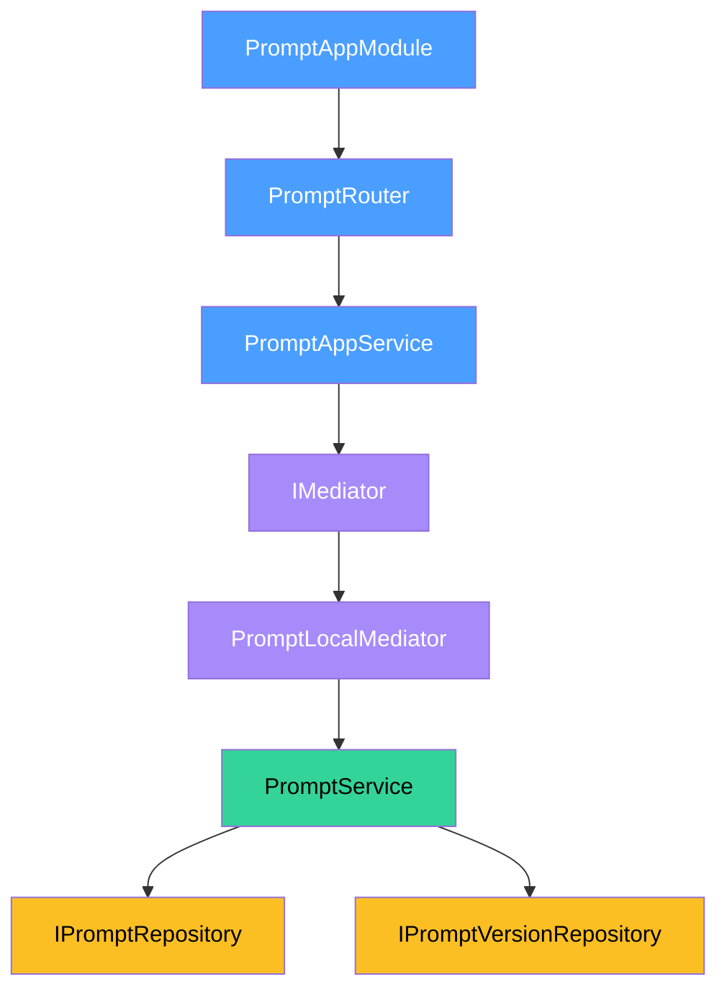

# Prompt -- Setup

How to register the Prompt domain module, wire its mediator client, and satisfy its DI tokens.

## App Module

`PromptAppModule.forRoot()` registers the router and app-layer service. Pass a `PromptMiddlewareConfig` to attach middleware to individual routes.

```typescript
import { PromptAppModule } from '@sanamyvn/ai-ts/app/prompt/module';

PromptAppModule.forRoot({
  middleware: {
    create: [authMiddleware],
    list: [],
    getBySlug: [],
    update: [authMiddleware],
    createVersion: [authMiddleware],
    activateVersion: [authMiddleware],
    listVersions: [],
  },
});
```

Every key in the middleware config is optional. Omitted keys apply no middleware to that route.

## Mediator Client

The mediator client decouples `PromptAppService` from the business-layer `PromptService`. Choose one provider function based on your deployment topology.

### Monolith

All domains run in one process. The local mediator calls `PromptService` directly through the DI container.

```typescript
import { promptClientMonolithProviders } from '@sanamyvn/ai-ts/app/prompt-client/module';

const promptClient = promptClientMonolithProviders();
// Spread into your module:
// providers: [...promptClient.providers]
// exports:   [...promptClient.exports]
```

### Standalone

The prompt service runs as a separate deployment. The remote mediator routes calls over HTTP.

```typescript
import { promptClientStandaloneProviders } from '@sanamyvn/ai-ts/app/prompt-client/module';

const promptClient = promptClientStandaloneProviders({
  baseUrl: 'https://ai.example.com',
  httpClientToken: MY_HTTP_CLIENT,
});
// Spread into your module:
// providers: [...promptClient.providers]
// exports:   [...promptClient.exports]
```

`httpClientToken` must resolve to an object with `get`, `post`, and `patch` methods. See the `HttpClient` interface in `prompt-remote.mediator.ts` for the full contract.

## Required Tokens

| Token | Type | Who Provides |
|-------|------|--------------|
| `AI_DB` | `PostgresClient<AiSchema>` | Downstream app |
| `AI_MEDIATOR` | `IMediator` | Downstream app (foundation mediator) |
| `PROMPT_REPOSITORY` | `IPromptRepository` | Auto-bound by repository providers |
| `PROMPT_VERSION_REPOSITORY` | `IPromptVersionRepository` | Auto-bound by repository providers |
| `PROMPT_MIDDLEWARE_CONFIG` | `PromptMiddlewareConfig` | Auto-bound by `PromptAppModule.forRoot()` |

`AI_DB` and `AI_MEDIATOR` are the only tokens your application must bind. The module and repository providers handle the rest.

## Module Flow



**Blue** -- app layer (router, app service). **Purple** -- mediator layer (transport abstraction). **Green** -- business layer (domain logic). **Yellow** -- repository layer (data access).

The app service sends commands and queries through the foundation `IMediator`. In monolith mode, `PromptLocalMediator` handles them in-process. In standalone mode, `PromptRemoteMediator` forwards them over HTTP to a remote prompt service.
