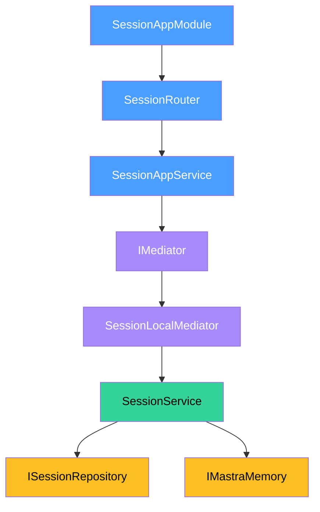

# Session -- Setup

How to register the Session domain module, wire its mediator client, and satisfy its DI tokens.

## App Module

`SessionAppModule.forRoot()` registers the router and app-layer service. Pass a `SessionMiddlewareConfig` to attach middleware to individual routes.

```typescript
import { SessionAppModule } from '@sanamyvn/ai-ts/app/session/module';

SessionAppModule.forRoot({
  middleware: {
    list: [authMiddleware],
    get: [],
    getMessages: [authMiddleware],
    exportTranscript: [authMiddleware],
    end: [authMiddleware],
  },
});
```

Every key in the middleware config is optional. Omitted keys apply no middleware to that route.

## Mediator Client

The mediator client decouples `SessionAppService` from the business-layer `SessionService`. Choose one provider function based on your deployment topology.

### Monolith

All domains run in one process. The local mediator calls `SessionService` directly through the DI container.

```typescript
import { sessionClientMonolithProviders } from '@sanamyvn/ai-ts/app/session-client/module';

const sessionClient = sessionClientMonolithProviders();
// Spread into your module:
// providers: [...sessionClient.providers]
// exports:   [...sessionClient.exports]
```

### Standalone

The session service runs as a separate deployment. The remote mediator routes calls over HTTP.

```typescript
import { sessionClientStandaloneProviders } from '@sanamyvn/ai-ts/app/session-client/module';

const sessionClient = sessionClientStandaloneProviders({
  baseUrl: 'https://ai.example.com',
  httpClientToken: MY_HTTP_CLIENT,
});
// Spread into your module:
// providers: [...sessionClient.providers]
// exports:   [...sessionClient.exports]
```

`httpClientToken` must resolve to an object with `get`, `post`, and `patch` methods. See the `HttpClient` interface in `session-remote.mediator.ts` for the full contract.

## Required Tokens

| Token | Type | Who Provides |
|-------|------|--------------|
| `AI_DB` | `PostgresClient<AiSchema>` | Downstream app |
| `AI_MEDIATOR` | `IMediator` | Downstream app (foundation mediator) |
| `MASTRA_MEMORY` | `IMastraMemory` | Downstream app (Mastra integration) |
| `SESSION_REPOSITORY` | `ISessionRepository` | Auto-bound by repository providers |
| `SESSION_MIDDLEWARE_CONFIG` | `SessionMiddlewareConfig` | Auto-bound by `SessionAppModule.forRoot()` |

`AI_DB`, `AI_MEDIATOR`, and `MASTRA_MEMORY` are the tokens your application must bind. The module and repository providers handle the rest.

## Module Flow



**Blue** -- app layer (router, app service). **Purple** -- mediator layer (transport abstraction). **Green** -- business layer (domain logic). **Yellow** -- data layer (repository, Mastra memory).

The app service sends commands and queries through the foundation `IMediator`. In monolith mode, `SessionLocalMediator` handles them in-process. In standalone mode, `SessionRemoteMediator` forwards them over HTTP to a remote session service.
