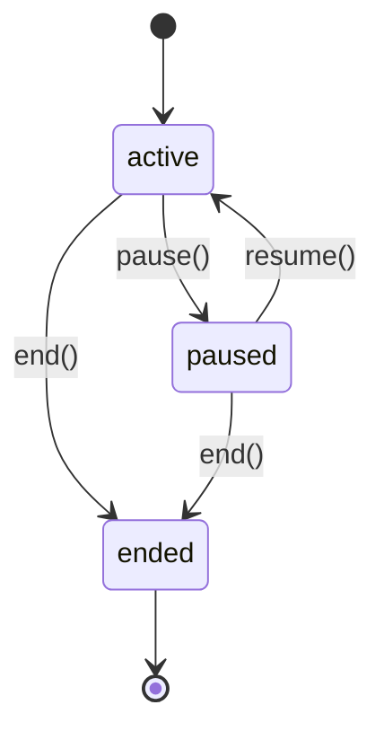

# Session -- Usage

## Start a Session

```typescript
import type { ISessionService } from '@sanamyvn/ai-ts/business/session';
import { SESSION_SERVICE } from '@sanamyvn/ai-ts/business/session';

const session = await sessionService.start({
  userId: 'user-42',
  promptSlug: 'onboarding-chat',
  resolvedPrompt: 'You are a helpful onboarding assistant...',
  purpose: 'onboarding',
  tenantId: 'tenant-1',        // optional
  metadata: { source: 'web' }, // optional
});
```

`resolvedPrompt` is the fully rendered prompt string. The conversation engine resolves it automatically, but direct callers must provide it themselves.

Under the hood, `start()` creates a Mastra thread and an `ai_sessions` row linked through the `mastraThreadId` field.

## Session Lifecycle

A session moves through three states: `active`, `paused`, and `ended`.



### Pause

Suspends the session. No return value.

```typescript
await sessionService.pause(sessionId);
```

### Resume

Reactivates a paused session. Returns the updated `Session`.

```typescript
const session = await sessionService.resume(sessionId);
```

### End

Terminates the session and records an `endedAt` timestamp. No return value.

```typescript
await sessionService.end(sessionId);
```

Calling `pause()`, `resume()`, or `end()` on an already-ended session throws `SessionAlreadyEndedError`.

## Retrieve Messages

```typescript
const messageList = await sessionService.getMessages(sessionId, {
  page: 1,
  perPage: 20,
});
```

Loads the `mastraThreadId` from the session record and delegates to Mastra memory to fetch the conversation history.

## Export Transcript

```typescript
const transcript = await sessionService.exportTranscript(sessionId, 'json');
// transcript.content  -- stringified JSON or plain-text rendering
// transcript.messages -- raw message array
```

Fetches all messages from the Mastra thread, then formats them as JSON or plain text. The `json` format produces a pretty-printed JSON string; the `text` format renders each message as `[role] content`, one per line.

## Error Handling

```typescript
import {
  SessionNotFoundError,
  SessionAlreadyEndedError,
  isSessionNotFoundError,
  isSessionAlreadyEndedError,
} from '@sanamyvn/ai-ts/business/session/error';
```

| Error | When | Type Guard |
|-------|------|------------|
| `SessionNotFoundError` | Session ID does not match any record | `isSessionNotFoundError()` |
| `SessionAlreadyEndedError` | Calling `pause()`, `resume()`, or `end()` on an ended session | `isSessionAlreadyEndedError()` |

Both errors extend `SessionError` and carry the offending session ID as a public `identifier` or `sessionId` property.
