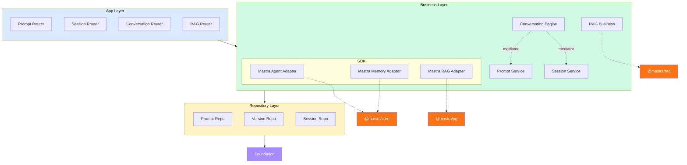

# RAG Module Design

Package: `@sanamyvn/ai-ts`

Add a RAG (Retrieval-Augmented Generation) domain to the existing layered architecture. The module handles the write path — ingesting content into vector storage — so that Mastra agents can query it at runtime through their built-in tool use. Downstream apps call `ingest`, `delete`, and `replace`. Everything else (chunking, embedding, index management, vector operations) is internal.

## Problem

The `aiya` project has a RAG module that directly uses `@mastra/rag` and `@mastra/pg`. This couples the application to Mastra's RAG internals. Since RAG is foundational AI infrastructure used across products, it belongs in `@sanamyvn/ai-ts` — wrapped behind stable interfaces, following the same adapter pattern as `IMastraAgent` and `IMastraMemory`.

**Revision of original design:** The original package design (`docs/plans/2026-03-15-ai-package-design.md`) listed RAG as "Mastra (direct)" and decided against wrapping it. Experience building the `aiya` RAG module showed that the write path (ingest/delete/replace) is common enough to standardize. The read path (retrieval/similarity search) remains "Mastra direct" — agents handle that through built-in tools. This spec wraps only the write-path operations. The original design doc should be updated to reflect this change.

## Relationship to Existing Architecture

| Concern                                         | Owner                                           |
| ----------------------------------------------- | ----------------------------------------------- |
| Content processing (text, HTML, markdown, JSON) | `@sanamyvn/ai-ts` (via `MDocument` factories)   |
| Chunking pipeline                               | `@sanamyvn/ai-ts` (via `@mastra/rag` MDocument) |
| Embedding generation                            | `@sanamyvn/ai-ts` (via `ai` SDK `embedMany`)    |
| Vector storage (PgVector)                       | `@sanamyvn/ai-ts` (adapter wraps `@mastra/pg`)  |
| Vector retrieval / similarity search            | Mastra agent (direct, via built-in tools)       |
| Binary file parsing (PDF, etc.)                 | Downstream app                                  |
| File fetching (S3, mediator, etc.)              | Downstream app                                  |

## Architecture

The RAG module adds a fourth domain vertical alongside prompt, session, and conversation. It follows the same 3-layer structure with an SDK adapter.



Note: RAG has no repository layer of its own. Vector storage is handled entirely through the Mastra RAG adapter (`PgVector`), not through Drizzle tables.

### Directory Structure

```
src/
├── business/
│   ├── sdk/
│   │   └── mastra/
│   │       ├── mastra.interface.ts         # + IMastraRag, MASTRA_RAG, MASTRA_CORE_RAG
│   │       ├── adapters/
│   │       │   ├── mastra.agent.ts
│   │       │   ├── mastra.memory.ts
│   │       │   └── mastra.rag.ts           # NEW — MastraRagAdapter
│   │       ├── mastra.error.ts
│   │       ├── mastra.providers.ts         # + bind(MASTRA_RAG, MastraRagAdapter)
│   │       └── mastra.testing.ts           # + createMockMastraRag()
│   │
│   ├── domain/
│   │   ├── prompt/
│   │   ├── session/
│   │   ├── conversation/
│   │   └── rag/                            # NEW
│   │       ├── rag.interface.ts            # IRagBusiness + RAG_BUSINESS token
│   │       ├── rag.business.ts             # RagBusiness implementation
│   │       ├── rag.model.ts                # IngestInput, DeleteInput, ReplaceInput, etc.
│   │       ├── rag.error.ts                # RagIngestError, RagDeleteError, etc.
│   │       ├── rag.providers.ts            # ragBusinessProviders()
│   │       ├── rag.testing.ts              # createMockRagBusiness()
│   │       └── client/
│   │           ├── queries.ts              # RagIngestCommand, RagDeleteCommand, RagReplaceCommand
│   │           ├── schemas.ts              # Zod schemas for mediator payloads
│   │           ├── errors.ts               # RagClientError hierarchy
│   │           └── mediator.ts             # IRagMediator + RAG_MEDIATOR token
│   │
│   └── providers.ts                        # + ragBusinessProviders()
│
├── app/
│   ├── domain/
│   │   ├── prompt/
│   │   ├── session/
│   │   ├── conversation/
│   │   └── rag/                            # NEW
│   │       ├── rag.router.ts               # REST: /ai/rag
│   │       ├── rag.service.ts              # Error mapping
│   │       ├── rag.dto.ts                  # Zod request/response schemas
│   │       ├── rag.mapper.ts               # Business → DTO
│   │       ├── rag.error.ts                # HTTP errors
│   │       ├── rag.tokens.ts               # RAG_MIDDLEWARE_CONFIG
│   │       ├── rag.providers.ts            # ragAppProviders()
│   │       └── rag.module.ts               # RagAppModule.forRoot(options)
│   │
│   ├── sdk/
│   │   ├── prompt-client/
│   │   ├── session-client/
│   │   ├── conversation-client/
│   │   └── rag-client/                     # NEW
│   │       ├── rag-local.mediator.ts
│   │       ├── rag-remote.mediator.ts
│   │       ├── rag-client.module.ts        # forMonolith() / forStandalone()
│   │       └── rag.mapper.ts
│   │
│   └── providers.ts                        # + ragAppProviders()
│
└── config.ts                               # + embeddingModel, embeddingDimension
```

## SDK Layer: Mastra RAG Adapter

Extends the existing Mastra adapter pattern. Wraps `PgVector` from `@mastra/pg` behind a stable interface.

### Interface

Added to `mastra.interface.ts` alongside `IMastraAgent` and `IMastraMemory`:

```typescript
export interface IMastraRag {
  /** Create a vector index if it does not already exist (idempotent). */
  createIndex(indexName: string, dimension: number): Promise<void>;
  /** Upsert vectors with metadata. Returns the number of vectors submitted (not necessarily stored — PgVector may deduplicate). */
  upsert(
    indexName: string,
    vectors: number[][],
    metadata: Record<string, unknown>[],
  ): Promise<number>;
  /** Delete vectors matching the metadata filter. Returns the number of vectors deleted. Note: assumes PgVector.deleteVectors returns a count — verify against @mastra/pg API when adding the dependency. */
  delete(indexName: string, filter: Record<string, unknown>): Promise<number>;
}

export const MASTRA_RAG = createToken<IMastraRag>('MASTRA_RAG');
export const MASTRA_CORE_RAG = createToken<PgVector>('MASTRA_CORE_RAG');
```

- `MASTRA_RAG` — stable interface token, bound by `ai-ts` to the adapter
- `MASTRA_CORE_RAG` — raw `PgVector` token, provided by downstream app

### Adapter

```typescript
@Injectable()
export class MastraRagAdapter implements IMastraRag {
  constructor(@Inject(MASTRA_CORE_RAG) private readonly pgVector: PgVector) {}

  async createIndex(indexName: string, dimension: number): Promise<void> {
    try {
      await this.pgVector.createIndex(indexName, dimension);
    } catch (error) {
      throw new MastraAdapterError('createIndex', error);
    }
  }

  async upsert(
    indexName: string,
    vectors: number[][],
    metadata: Record<string, unknown>[],
  ): Promise<number> {
    try {
      await this.pgVector.upsert(indexName, vectors, metadata);
      return vectors.length;
    } catch (error) {
      throw new MastraAdapterError('upsert', error);
    }
  }

  async delete(indexName: string, filter: Record<string, unknown>): Promise<number> {
    try {
      return await this.pgVector.deleteVectors(indexName, filter);
    } catch (error) {
      throw new MastraAdapterError('delete', error);
    }
  }
}
```

### Providers

`mastraProviders()` updated:

```typescript
export function mastraProviders() {
  return {
    providers: [
      bind(MASTRA_AGENT, MastraAgentAdapter),
      bind(MASTRA_MEMORY, MastraMemoryAdapter),
      bind(MASTRA_RAG, MastraRagAdapter),
    ],
    exports: [MASTRA_AGENT, MASTRA_MEMORY, MASTRA_RAG],
  };
}
```

### Testing

```typescript
export function createMockMastraRag() {
  return {
    createIndex: vi.fn<IMastraRag['createIndex']>(),
    upsert: vi.fn<IMastraRag['upsert']>(),
    delete: vi.fn<IMastraRag['delete']>(),
  };
}
```

## Business Layer: RAG Domain

### Interface

```typescript
export interface IRagBusiness {
  ingest(input: IngestInput): Promise<IngestResult>;
  delete(input: DeleteInput): Promise<DeleteResult>;
  replace(input: ReplaceInput): Promise<ReplaceResult>;
}

export const RAG_BUSINESS = createToken<IRagBusiness>('RAG_BUSINESS');
```

### Models

```typescript
// Content types matching MDocument factory methods
export interface RagContent {
  type: 'text' | 'html' | 'markdown' | 'json';
  data: string;
}

// Per-document input for batch ingestion
export interface DocumentInput {
  documentId: string;
  content: RagContent;
}

// Chunking options (overrides defaults)
export interface ChunkOptions {
  strategy?:
    | 'recursive'
    | 'character'
    | 'token'
    | 'markdown'
    | 'html'
    | 'json'
    | 'latex'
    | 'sentence'
    | 'semantic-markdown';
  maxSize?: number;
  overlap?: number;
}

// Ingest: batch of documents into a scope
export interface IngestInput {
  scopeId: string;
  documents: DocumentInput[];
  chunkOptions?: ChunkOptions;
}

export interface IngestResult {
  chunksStored: number;
}

// Delete: by metadata filter within a scope
export interface DeleteInput {
  scopeId: string;
  filter: Record<string, unknown>;
}

export interface DeleteResult {
  chunksDeleted: number;
}

// Replace: delete old vectors for a document, ingest new content
export interface ReplaceInput {
  scopeId: string;
  documentId: string;
  content: RagContent;
  chunkOptions?: ChunkOptions;
}

export interface ReplaceResult {
  chunksDeleted: number;
  chunksStored: number;
}
```

### Business Implementation

The business layer maps `RagContent.type` directly to the corresponding `MDocument.from*()` factory. No pluggable processor abstraction — `MDocument` already supports text, HTML, markdown, and JSON. For unsupported formats (PDF, proprietary), downstream apps convert to one of these types before calling ingest.

```typescript
@Injectable()
export class RagBusiness implements IRagBusiness {
  constructor(
    @Inject(MASTRA_RAG) private readonly mastraRag: IMastraRag,
    @Inject(AI_CONFIG) private readonly config: AiConfig,
  ) {}

  async ingest(input: IngestInput): Promise<IngestResult> {
    await this.mastraRag.createIndex(input.scopeId, this.config.embeddingDimension);

    let totalChunks = 0;

    for (const doc of input.documents) {
      const mdoc = this.createDocument(doc.content, {
        documentId: doc.documentId,
        scopeId: input.scopeId,
      });

      const chunks = await mdoc.chunk({
        strategy: input.chunkOptions?.strategy ?? DEFAULT_CHUNK_STRATEGY,
        size: input.chunkOptions?.maxSize ?? DEFAULT_CHUNK_SIZE,
        overlap: input.chunkOptions?.overlap ?? DEFAULT_CHUNK_OVERLAP,
      });

      const embeddings = await this.embedBatched(chunks.map((c) => c.text));

      await this.mastraRag.upsert(
        input.scopeId,
        embeddings,
        chunks.map((c) => ({ text: c.text, documentId: doc.documentId, scopeId: input.scopeId })),
      );

      totalChunks += embeddings.length;
    }

    return { chunksStored: totalChunks };
  }

  async delete(input: DeleteInput): Promise<DeleteResult> {
    const chunksDeleted = await this.mastraRag.delete(input.scopeId, input.filter);
    return { chunksDeleted };
  }

  async replace(input: ReplaceInput): Promise<ReplaceResult> {
    const { chunksDeleted } = await this.delete({
      scopeId: input.scopeId,
      filter: { documentId: input.documentId },
    });

    const { chunksStored } = await this.ingest({
      scopeId: input.scopeId,
      documents: [{ documentId: input.documentId, content: input.content }],
      chunkOptions: input.chunkOptions,
    });

    return { chunksDeleted, chunksStored };
  }

  private createDocument(content: RagContent, metadata: Record<string, unknown>): MDocument {
    switch (content.type) {
      case 'text':
        return MDocument.fromText(content.data, metadata);
      case 'html':
        return MDocument.fromHTML(content.data, metadata);
      case 'markdown':
        return MDocument.fromMarkdown(content.data, metadata);
      case 'json':
        return MDocument.fromJSON(content.data, metadata);
    }
  }

  // Uses embedMany from 'ai' SDK and ModelRouterEmbeddingModel from '@mastra/core/llm'
  // to generate embeddings in batches (avoids rate limits on embedding APIs).
  private async embedBatched(texts: string[]): Promise<number[][]> {
    const allEmbeddings: number[][] = [];

    for (let i = 0; i < texts.length; i += DEFAULT_EMBEDDING_BATCH_SIZE) {
      const batch = texts.slice(i, i + DEFAULT_EMBEDDING_BATCH_SIZE);
      const { embeddings } = await embedMany({
        model: new ModelRouterEmbeddingModel(this.config.embeddingModel),
        values: batch,
      });
      allEmbeddings.push(...embeddings);
    }

    return allEmbeddings;
  }
}

// Constants
const DEFAULT_CHUNK_STRATEGY = 'recursive';
const DEFAULT_CHUNK_SIZE = 512;
const DEFAULT_CHUNK_OVERLAP = 50;
const DEFAULT_EMBEDDING_BATCH_SIZE = 100;
```

### Errors

```typescript
RagBusinessError (base)
├── RagIngestError              — wraps MastraAdapterError during ingest pipeline
├── RagDeleteError              — wraps MastraAdapterError during delete
└── RagEmbeddingError           — embedding generation failure
```

### Client (Mediator Contracts)

Following the existing `createCommand`/`createQuery` factory pattern with Zod schemas (matching `prompt/client/queries.ts`):

```typescript
// client/queries.ts
import { createCommand } from '@sanamyvn/foundation/mediator/request';
import {
  ingestClientSchema,
  deleteClientSchema,
  replaceClientSchema,
  ingestResultSchema,
  deleteResultSchema,
  replaceResultSchema,
} from './schemas.js';

export const RagIngestCommand = createCommand({
  type: 'ai.rag.ingest',
  payload: ingestClientSchema,
  response: ingestResultSchema,
});

export const RagDeleteCommand = createCommand({
  type: 'ai.rag.delete',
  payload: deleteClientSchema,
  response: deleteResultSchema,
});

export const RagReplaceCommand = createCommand({
  type: 'ai.rag.replace',
  payload: replaceClientSchema,
  response: replaceResultSchema,
});
```

```typescript
// client/mediator.ts
import { createMediatorToken } from '@sanamyvn/foundation/mediator/mediator-token';
import type { IngestClientResult, DeleteClientResult, ReplaceClientResult } from './schemas.js';
import { RagIngestCommand, RagDeleteCommand, RagReplaceCommand } from './queries.js';

export interface IRagMediator {
  ingest(command: InstanceType<typeof RagIngestCommand>): Promise<IngestClientResult>;
  delete(command: InstanceType<typeof RagDeleteCommand>): Promise<DeleteClientResult>;
  replace(command: InstanceType<typeof RagReplaceCommand>): Promise<ReplaceClientResult>;
}

export const RAG_MEDIATOR = createMediatorToken<IRagMediator>('RAG_MEDIATOR', {
  ingest: RagIngestCommand,
  delete: RagDeleteCommand,
  replace: RagReplaceCommand,
});
```

## App Layer: RAG Domain

### REST Endpoints

| Method   | Path                            | Purpose                                       |
| -------- | ------------------------------- | --------------------------------------------- |
| `POST`   | `/ai/rag/ingest`                | Ingest batch of documents into a scope        |
| `DELETE` | `/ai/rag/documents`             | Delete vectors by metadata filter             |
| `PUT`    | `/ai/rag/documents/:documentId` | Replace a document's vectors with new content |

### DTOs

**Ingest request:**

```typescript
const ingestRequestSchema = z.object({
  scopeId: z.string().check(z.uuid()),
  documents: z
    .array(
      z.object({
        documentId: z.string().check(z.uuid()),
        content: z.object({
          type: z.enum(['text', 'html', 'markdown', 'json']),
          data: z.string(),
        }),
      }),
    )
    .min(1),
  chunkOptions: z
    .object({
      strategy: z
        .enum([
          'recursive',
          'character',
          'token',
          'markdown',
          'html',
          'json',
          'latex',
          'sentence',
          'semantic-markdown',
        ])
        .optional(),
      maxSize: z.number().positive().optional(),
      overlap: z.number().nonnegative().optional(),
    })
    .optional(),
});
```

**Ingest response:** `{ chunksStored: number }`

**Delete request:**

```typescript
const deleteRequestSchema = z.object({
  scopeId: z.string().check(z.uuid()),
  filter: z.record(z.unknown()),
});
```

**Delete response:** `{ chunksDeleted: number }`

**Replace request:**

```typescript
const replaceRequestSchema = z.object({
  scopeId: z.string().check(z.uuid()),
  content: z.object({
    type: z.enum(['text', 'html', 'markdown', 'json']),
    data: z.string(),
  }),
  chunkOptions: z
    .object({
      strategy: z
        .enum([
          'recursive',
          'character',
          'token',
          'markdown',
          'html',
          'json',
          'latex',
          'sentence',
          'semantic-markdown',
        ])
        .optional(),
      maxSize: z.number().positive().optional(),
      overlap: z.number().nonnegative().optional(),
    })
    .optional(),
});
```

**Replace response:** `{ chunksDeleted: number, chunksStored: number }`

### Service

Thin orchestrator. Maps business errors to HTTP errors:

| Business Error      | HTTP Error                |
| ------------------- | ------------------------- |
| `RagIngestError`    | 500 Internal Server Error |
| `RagDeleteError`    | 500 Internal Server Error |
| `RagEmbeddingError` | 500 Internal Server Error |

### Module

```typescript
export class RagAppModule extends Module {
  static forRoot(options: RagAppModuleOptions): ModuleDefinition {
    // options.middleware — per-route middleware config
  }
}

interface RagAppModuleOptions {
  middleware?: {
    ingest?: Middleware[];
    delete?: Middleware[];
    replace?: Middleware[];
  };
}
```

### Mediator Clients

Following the existing pattern:

```typescript
// rag-client.module.ts
export class RagClientModule {
  static forMonolith(): ModuleDefinition {
    // Uses RagLocalMediator — wraps RagBusiness in-process
  }

  static forStandalone(options: { ragServiceUrl: string }): ModuleDefinition {
    // Uses RagRemoteMediator — HTTP calls to RAG service
  }
}
```

## Configuration

Extend the existing `aiConfigSchema` in `src/config.ts`:

```typescript
export const aiConfigSchema = z.object({
  defaultModel: z.string(),
  // ... existing fields
  embeddingModel: z.string(), // e.g. 'openai/text-embedding-3-small'
  embeddingDimension: z.number(), // e.g. 1536
});
```

No separate RAG config object. Chunking defaults (512 size, 50 overlap, recursive strategy, 100 batch size) are hardcoded constants in the business layer. Callers override per-ingest via `chunkOptions`.

## Error Hierarchy

```
Business:
  MastraAdapterError (existing)     ← wraps all @mastra/pg exceptions

  RagBusinessError (base)
  ├── RagIngestError                ← wraps MastraAdapterError during ingest
  ├── RagDeleteError                ← wraps MastraAdapterError during delete
  ├── RagContentProcessingError     ← no processor for content type
  └── RagEmbeddingError             ← embedding generation failure

Client (mediator):
  RagClientError (base)

App:
  RagHttpIngestError extends HttpInternalServerError
  RagHttpDeleteError extends HttpInternalServerError
```

Error wrapping flow:

```
PgVector throws → MastraAdapterError (SDK adapter boundary)
  → RagIngestError (business catches adapter error)
    → RagHttpIngestError 500 (app service maps business error)

embedMany() throws → RagEmbeddingError (business catches embedding error)
  → RagHttpIngestError 500 (app service maps business error)
```

## Package Exports

New entries in `package.json` `exports`:

```json
{
  "./business/rag": { "types": "...", "default": "..." },
  "./business/rag/client": { "types": "...", "default": "..." },
  "./app/rag": { "types": "...", "default": "..." },
  "./app/rag-client": { "types": "...", "default": "..." }
}
```

The Mastra RAG tokens (`MASTRA_RAG`, `MASTRA_CORE_RAG`) are exported via the existing `./business/mastra` entry point.

## New Peer Dependencies

```json
{
  "peerDependencies": {
    "@mastra/core": "^1.0.0",
    "@mastra/rag": "^2.1.0",
    "@mastra/pg": "^1.8.0",
    "@sanamyvn/foundation": "^1.12.0",
    "ai": "^6.0.0",
    "drizzle-orm": ">=0.45.1",
    "zod": "^4.0.0"
  }
}
```

`@mastra/rag`, `@mastra/pg`, and `ai` are new additions.

## Downstream Wiring

```typescript
// Downstream app provides raw PgVector and configures the module
import { PgVector } from '@mastra/pg';

// Provide the raw PgVector instance
bind(MASTRA_CORE_RAG, new PgVector(process.env.DATABASE_URL));

// Wire up the RAG module with middleware
RagAppModule.forRoot({
  middleware: {
    ingest: [AuthMiddleware],
    delete: [AuthMiddleware, AdminMiddleware],
    replace: [AuthMiddleware],
  },
}),
```

## Decisions

| Decision                                   | Rationale                                                                                                                                                                                                                                           |
| ------------------------------------------ | --------------------------------------------------------------------------------------------------------------------------------------------------------------------------------------------------------------------------------------------------- |
| Write path only (no query/search)          | Mastra agents handle retrieval through built-in tool use. The RAG module manages the data pipeline.                                                                                                                                                 |
| PgVector only, no pluggable vector store   | The package already requires PostgreSQL. PgVector is the natural fit. Avoids premature abstraction.                                                                                                                                                 |
| No PDF or custom format support in package | `MDocument` supports text/HTML/markdown/JSON natively — the business layer maps directly to these factories. For unsupported formats (PDF, proprietary), downstream converts to a supported type before calling ingest.                             |
| Batch ingest                               | Multiple documents per request reduces HTTP overhead for bulk operations.                                                                                                                                                                           |
| Replace as a first-class operation         | Common workflow when content changes. Performs delete then ingest sequentially. Not transactionally atomic — if ingest fails after delete, the old vectors are lost. Acceptable for a search index where brief inconsistency windows are tolerable. |
| Embedding config in `AI_CONFIG`            | Centralized configuration. No separate RAG config token.                                                                                                                                                                                            |
| Chunking defaults hardcoded                | Implementation detail. Per-ingest `chunkOptions` provides flexibility without config complexity.                                                                                                                                                    |

## Out of Scope

- **Vector retrieval / similarity search** — handled by Mastra agents at runtime
- **PDF / binary file parsing** — downstream responsibility
- **File fetching (S3, mediator)** — downstream responsibility
- **Hybrid search / reranking** — future enhancement if needed
- **Multiple vector store backends** — PgVector only for now
