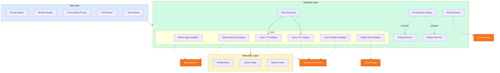

# Voice Module Design

Package: `@sanamyvn/ai-ts`

Add a Voice domain to the existing layered architecture. The module wraps Mastra's Voice system (`MastraVoice`, `CompositeVoice`) behind three stable, segregated interfaces — TTS, STT, and Realtime — so that downstream apps never import `@mastra/core/voice` directly for these operations. Downstream apps that need full realtime STS inject the realtime adapter directly from the SDK layer; TTS and STT flow through the standard 3-layer mediator pattern.

## Problem

The `ai-ts` package currently wraps Mastra Agent and Memory behind stable adapter interfaces, and the RAG spec extends this pattern to vector storage. Voice capabilities (text-to-speech, speech-to-text, realtime speech-to-speech) remain unwrapped — downstream apps use Mastra voice providers directly.

This creates the same coupling problem that motivated the Agent, Memory, and RAG adapters: downstream business logic depends on Mastra's voice API surface, making provider swaps and SDK upgrades risky. Since voice is foundational AI infrastructure used across products, it belongs in `ai-ts` behind stable interfaces.

## Relationship to Existing Architecture

| Concern | Owner |
| --- | --- |
| Text-to-speech (text → audio stream) | `@sanamyvn/ai-ts` (via `IMastraVoiceTts` adapter) |
| Speech-to-text (audio → text) | `@sanamyvn/ai-ts` (via `IMastraVoiceStt` adapter) |
| Realtime STS session management | `@sanamyvn/ai-ts` (via `IMastraVoiceRealtime` adapter) |
| Voice provider construction & configuration | Downstream app (creates `CompositeVoice` or `MastraVoice`) |
| VAD configuration | Downstream app (provider-specific) |
| Client-facing WebSocket / realtime module | Downstream app (separate module) |
| Audio format conversion | Downstream app |
| Audio file storage | Downstream app |

### How Realtime Fits

Downstream apps own their client-facing WebSocket connections. The realtime adapter wraps the Mastra-to-provider connection (e.g., Mastra → OpenAI Realtime API). Two WebSocket connections exist in the STS path:

1. **Client ↔ Downstream realtime module** — owned by downstream, ai-ts doesn't touch it
2. **Mastra Voice ↔ Provider API** — Mastra owns this, ai-ts wraps it behind `IMastraVoiceRealtime`

```
Client (browser/mobile)
  │
  │ WebSocket (downstream's realtime module)
  ▼
┌─────────────────────────────────┐
│  Downstream Realtime Module     │  ← Owns client-facing WebSocket
└──────────┬──────────────────────┘
           │  calls downstream STS business layer
           ▼
┌─────────────────────────────────┐
│  Downstream STS Business Layer  │  ← Injects IMastraVoiceRealtime
└──────────┬──────────────────────┘
           │  uses ai-ts adapter
           ▼
┌─────────────────────────────────┐
│  ai-ts Voice Realtime Adapter   │  ← Wraps MastraVoice
└──────────┬──────────────────────┘
           │  WebSocket (Mastra's)
           ▼
┌─────────────────────────────────┐
│  OpenAI Realtime / Gemini Live  │  ← Provider API
└─────────────────────────────────┘
```

## Architecture

The Voice module adds a fifth domain vertical alongside prompt, session, conversation, and RAG. It follows the same 3-layer structure with an SDK adapter, with the exception that the realtime interface has no business or app layer (it's stateful and event-driven, incompatible with the command/response mediator pattern).



Note: Voice has no repository layer — all operations delegate to Mastra voice providers directly. Voice Realtime Adapter has no business or app layer — downstream STS business layers inject it directly from the SDK.

### Directory Structure

```
src/
├── business/
│   ├── sdk/
│   │   └── mastra/
│   │       ├── mastra.interface.ts          # + IMastraVoiceTts, IMastraVoiceStt, IMastraVoiceRealtime
│   │       │                                #   MASTRA_VOICE_TTS, MASTRA_VOICE_STT, MASTRA_VOICE_REALTIME
│   │       │                                #   MASTRA_CORE_VOICE
│   │       ├── adapters/
│   │       │   ├── mastra.agent.ts          # existing
│   │       │   ├── mastra.memory.ts         # existing
│   │       │   ├── mastra.rag.ts            # existing (from RAG spec)
│   │       │   ├── mastra.voice-tts.ts      # NEW
│   │       │   ├── mastra.voice-stt.ts      # NEW
│   │       │   └── mastra.voice-realtime.ts # NEW
│   │       ├── mastra.error.ts              # unchanged — reuses MastraAdapterError
│   │       ├── mastra.providers.ts          # + bind voice adapters
│   │       └── mastra.testing.ts            # + createMockMastraVoiceTts/Stt/Realtime()
│   │
│   ├── domain/
│   │   ├── prompt/                          # existing
│   │   ├── session/                         # existing
│   │   ├── conversation/                    # existing
│   │   ├── rag/                             # existing (from RAG spec)
│   │   └── voice/                           # NEW
│   │       ├── voice.interface.ts           # IVoiceBusiness + VOICE_BUSINESS token
│   │       ├── voice.business.ts            # VoiceBusiness implementation
│   │       ├── voice.model.ts               # TextToSpeechInput, SpeechToTextInput, etc.
│   │       ├── voice.error.ts               # VoiceTtsError, VoiceSttError
│   │       ├── voice.providers.ts           # voiceBusinessProviders()
│   │       ├── voice.testing.ts             # createMockVoiceBusiness()
│   │       └── client/
│   │           ├── queries.ts               # VoiceTextToSpeechCommand, VoiceSpeechToTextCommand, VoiceGetSpeakersQuery
│   │           ├── schemas.ts               # Zod schemas for mediator payloads
│   │           ├── errors.ts                # VoiceClientError hierarchy
│   │           └── mediator.ts              # IVoiceMediator + VOICE_MEDIATOR token
│   │
│   └── providers.ts                         # + voiceBusinessProviders()
│
├── app/
│   ├── domain/
│   │   ├── prompt/                          # existing
│   │   ├── session/                         # existing
│   │   ├── conversation/                    # existing
│   │   ├── rag/                             # existing (from RAG spec)
│   │   └── voice/                           # NEW
│   │       ├── voice.router.ts              # REST: /ai/voice
│   │       ├── voice.service.ts             # Error mapping
│   │       ├── voice.dto.ts                 # Zod request/response schemas
│   │       ├── voice.mapper.ts              # Business → DTO
│   │       ├── voice.error.ts               # HTTP errors
│   │       ├── voice.tokens.ts              # VOICE_MIDDLEWARE_CONFIG
│   │       ├── voice.providers.ts           # voiceAppProviders()
│   │       └── voice.module.ts              # VoiceAppModule.forRoot(options)
│   │
│   ├── sdk/
│   │   ├── prompt-client/                   # existing
│   │   ├── session-client/                  # existing
│   │   ├── conversation-client/             # existing
│   │   ├── rag-client/                      # existing (from RAG spec)
│   │   └── voice-client/                    # NEW
│   │       ├── voice-local.mediator.ts
│   │       ├── voice-remote.mediator.ts
│   │       ├── voice-client.module.ts       # forMonolith() / forStandalone()
│   │       └── voice.mapper.ts
│   │
│   └── providers.ts                         # + voiceAppProviders()
```

## SDK Layer: Mastra Voice Adapters

Extends the existing Mastra adapter pattern with three separate adapters, each wrapping the same raw `MastraVoice` instance but exposing only their interface slice. Follows the Interface Segregation Principle end-to-end.

### Interfaces

Added to `mastra.interface.ts` alongside `IMastraAgent`, `IMastraMemory`, and `IMastraRag`:

```typescript
import type { MastraVoice } from '@mastra/core/voice';

// ── Voice Types ──

export interface SpeakOptions {
  readonly speaker?: string;
  readonly [key: string]: unknown;
}

export interface VoiceSessionOptions {
  readonly [key: string]: unknown;
}

export type VoiceEventCallback = (data: unknown) => void;

// ── TTS Interface ──

export interface IMastraVoiceTts {
  /** Convert text to speech. Returns an audio stream, or void if the provider emits audio via events. */
  textToSpeech(
    input: string | NodeJS.ReadableStream,
    options?: SpeakOptions,
  ): Promise<NodeJS.ReadableStream | void>;

  /** List available voices from the provider. */
  getSpeakers(): Promise<Array<{ voiceId: string; [key: string]: unknown }>>;
}

// ── STT Interface ──

export interface IMastraVoiceStt {
  /** Convert speech to text. Returns transcribed text, a text stream, or void if the provider emits text via events. */
  speechToText(
    audioStream: NodeJS.ReadableStream,
    options?: Record<string, unknown>,
  ): Promise<string | NodeJS.ReadableStream | void>;
}

// ── Realtime Interface ──

export interface IMastraVoiceRealtime {
  /** Open a realtime voice session (connects to the provider via WebSocket). */
  openSession(options?: VoiceSessionOptions): Promise<void>;
  /** Close the realtime voice session. */
  closeSession(): void;
  /** Stream audio data to the provider for realtime processing. */
  sendAudio(audioData: NodeJS.ReadableStream | Int16Array): Promise<void>;
  /** Send text to the provider (in STS, the provider speaks it via events). */
  sendText(text: string): Promise<void>;
  /** Manually trigger the provider to generate a response (for push-to-talk without VAD). */
  triggerResponse(options?: Record<string, unknown>): Promise<void>;
  /** Register a listener for voice events (speaker, writing, error, etc.). */
  onEvent(event: string, callback: VoiceEventCallback): void;
  /** Remove a voice event listener. */
  offEvent(event: string, callback: VoiceEventCallback): void;
  /** Add tools the provider can invoke during a realtime session. */
  addTools(tools: unknown): void;
  /** Set system instructions for the realtime session. */
  addInstructions(instructions: string): void;
}

// ── DI Tokens ──

export const MASTRA_VOICE_TTS = createToken<IMastraVoiceTts>('MASTRA_VOICE_TTS');
export const MASTRA_VOICE_STT = createToken<IMastraVoiceStt>('MASTRA_VOICE_STT');
export const MASTRA_VOICE_REALTIME = createToken<IMastraVoiceRealtime>('MASTRA_VOICE_REALTIME');

/** Raw token — downstream provides a MastraVoice or CompositeVoice instance, fully configured. */
export const MASTRA_CORE_VOICE = createToken<MastraVoice>('MASTRA_CORE_VOICE');
```

- `MASTRA_VOICE_TTS`, `MASTRA_VOICE_STT`, `MASTRA_VOICE_REALTIME` — stable interface tokens, bound by ai-ts to adapters
- `MASTRA_CORE_VOICE` — raw `MastraVoice` token, provided by downstream app

### TTS Adapter

```typescript
@Injectable()
export class MastraVoiceTtsAdapter implements IMastraVoiceTts {
  constructor(@Inject(MASTRA_CORE_VOICE) private readonly voice: MastraVoice) {}

  async textToSpeech(
    input: string | NodeJS.ReadableStream,
    options?: SpeakOptions,
  ): Promise<NodeJS.ReadableStream | void> {
    try {
      return await this.voice.speak(input, options);
    } catch (error) {
      throw new MastraAdapterError('textToSpeech', error);
    }
  }

  async getSpeakers(): Promise<Array<{ voiceId: string; [key: string]: unknown }>> {
    try {
      return await this.voice.getSpeakers();
    } catch (error) {
      throw new MastraAdapterError('getSpeakers', error);
    }
  }
}
```

### STT Adapter

```typescript
@Injectable()
export class MastraVoiceSttAdapter implements IMastraVoiceStt {
  constructor(@Inject(MASTRA_CORE_VOICE) private readonly voice: MastraVoice) {}

  async speechToText(
    audioStream: NodeJS.ReadableStream,
    options?: Record<string, unknown>,
  ): Promise<string | NodeJS.ReadableStream | void> {
    try {
      return await this.voice.listen(audioStream, options);
    } catch (error) {
      throw new MastraAdapterError('speechToText', error);
    }
  }
}
```

### Realtime Adapter

```typescript
@Injectable()
export class MastraVoiceRealtimeAdapter implements IMastraVoiceRealtime {
  constructor(@Inject(MASTRA_CORE_VOICE) private readonly voice: MastraVoice) {}

  async openSession(options?: VoiceSessionOptions): Promise<void> {
    try {
      await this.voice.connect(options);
    } catch (error) {
      throw new MastraAdapterError('openSession', error);
    }
  }

  closeSession(): void {
    this.voice.close();
  }

  async sendAudio(audioData: NodeJS.ReadableStream | Int16Array): Promise<void> {
    try {
      await this.voice.send(audioData);
    } catch (error) {
      throw new MastraAdapterError('sendAudio', error);
    }
  }

  async sendText(text: string): Promise<void> {
    try {
      await this.voice.speak(text);
    } catch (error) {
      throw new MastraAdapterError('sendText', error);
    }
  }

  async triggerResponse(options?: Record<string, unknown>): Promise<void> {
    try {
      await this.voice.answer(options);
    } catch (error) {
      throw new MastraAdapterError('triggerResponse', error);
    }
  }

  onEvent(event: string, callback: VoiceEventCallback): void {
    this.voice.on(event, callback);
  }

  offEvent(event: string, callback: VoiceEventCallback): void {
    this.voice.off(event, callback);
  }

  addTools(tools: unknown): void {
    this.voice.addTools(tools);
  }

  addInstructions(instructions: string): void {
    this.voice.addInstructions(instructions);
  }
}
```

### Providers

`mastraProviders()` updated:

```typescript
export function mastraProviders() {
  return {
    providers: [
      bind(MASTRA_AGENT, MastraAgentAdapter),
      bind(MASTRA_MEMORY, MastraMemoryAdapter),
      bind(MASTRA_RAG, MastraRagAdapter),
      bind(MASTRA_VOICE_TTS, MastraVoiceTtsAdapter),
      bind(MASTRA_VOICE_STT, MastraVoiceSttAdapter),
      bind(MASTRA_VOICE_REALTIME, MastraVoiceRealtimeAdapter),
    ],
    exports: [
      MASTRA_AGENT, MASTRA_MEMORY, MASTRA_RAG,
      MASTRA_VOICE_TTS, MASTRA_VOICE_STT, MASTRA_VOICE_REALTIME,
    ],
  };
}
```

### Testing

```typescript
export function createMockMastraVoiceTts(): IMastraVoiceTts {
  return {
    textToSpeech: vi.fn<IMastraVoiceTts['textToSpeech']>(),
    getSpeakers: vi.fn<IMastraVoiceTts['getSpeakers']>(),
  };
}

export function createMockMastraVoiceStt(): IMastraVoiceStt {
  return {
    speechToText: vi.fn<IMastraVoiceStt['speechToText']>(),
  };
}

export function createMockMastraVoiceRealtime(): IMastraVoiceRealtime {
  return {
    openSession: vi.fn<IMastraVoiceRealtime['openSession']>(),
    closeSession: vi.fn<IMastraVoiceRealtime['closeSession']>(),
    sendAudio: vi.fn<IMastraVoiceRealtime['sendAudio']>(),
    sendText: vi.fn<IMastraVoiceRealtime['sendText']>(),
    triggerResponse: vi.fn<IMastraVoiceRealtime['triggerResponse']>(),
    onEvent: vi.fn<IMastraVoiceRealtime['onEvent']>(),
    offEvent: vi.fn<IMastraVoiceRealtime['offEvent']>(),
    addTools: vi.fn<IMastraVoiceRealtime['addTools']>(),
    addInstructions: vi.fn<IMastraVoiceRealtime['addInstructions']>(),
  };
}
```

## Business Layer: Voice Domain

The business layer wraps TTS and STT operations only. Realtime is excluded — it's stateful and event-driven, incompatible with the command/response mediator pattern. Downstream STS business layers inject `IMastraVoiceRealtime` directly from the SDK layer.

### Interface

```typescript
export interface IVoiceBusiness {
  textToSpeech(input: TextToSpeechInput): Promise<TextToSpeechResult>;
  speechToText(input: SpeechToTextInput): Promise<SpeechToTextResult>;
  getSpeakers(): Promise<GetSpeakersResult>;
}

export const VOICE_BUSINESS = createToken<IVoiceBusiness>('VOICE_BUSINESS');
```

### Models

```typescript
export interface TextToSpeechInput {
  readonly text: string;
  readonly speaker?: string;
  readonly options?: Record<string, unknown>;
}

export interface TextToSpeechResult {
  readonly audioStream: NodeJS.ReadableStream;
}

export interface SpeechToTextInput {
  readonly audioStream: NodeJS.ReadableStream;
  readonly options?: Record<string, unknown>;
}

export interface SpeechToTextResult {
  readonly text: string;
}

export interface Speaker {
  readonly voiceId: string;
  readonly [key: string]: unknown;
}

export interface GetSpeakersResult {
  readonly speakers: Speaker[];
}
```

### Business Implementation

```typescript
@Injectable()
export class VoiceBusiness implements IVoiceBusiness {
  constructor(
    @Inject(MASTRA_VOICE_TTS) private readonly tts: IMastraVoiceTts,
    @Inject(MASTRA_VOICE_STT) private readonly stt: IMastraVoiceStt,
  ) {}

  async textToSpeech(input: TextToSpeechInput): Promise<TextToSpeechResult> {
    try {
      const audioStream = await this.tts.textToSpeech(input.text, {
        speaker: input.speaker,
        ...input.options,
      });
      if (!audioStream) throw new VoiceTtsError('Provider returned no audio stream');
      return { audioStream };
    } catch (error) {
      if (error instanceof VoiceTtsError) throw error;
      throw new VoiceTtsError('textToSpeech', error);
    }
  }

  async speechToText(input: SpeechToTextInput): Promise<SpeechToTextResult> {
    try {
      const result = await this.stt.speechToText(input.audioStream, input.options);
      if (typeof result === 'string') return { text: result };
      if (!result) throw new VoiceSttError('Provider returned no transcription');
      return { text: await this.collectStream(result) };
    } catch (error) {
      if (error instanceof VoiceSttError) throw error;
      throw new VoiceSttError('speechToText', error);
    }
  }

  async getSpeakers(): Promise<GetSpeakersResult> {
    try {
      const speakers = await this.tts.getSpeakers();
      return { speakers };
    } catch (error) {
      throw new VoiceTtsError('getSpeakers', error);
    }
  }

  private async collectStream(stream: NodeJS.ReadableStream): Promise<string> {
    const chunks: Buffer[] = [];
    for await (const chunk of stream) {
      chunks.push(Buffer.from(chunk));
    }
    return Buffer.concat(chunks).toString('utf-8');
  }
}
```

### Errors

```
VoiceBusinessError (base)
├── VoiceTtsError    — wraps MastraAdapterError during TTS
└── VoiceSttError    — wraps MastraAdapterError during STT
```

### Client (Mediator Contracts)

```typescript
// client/queries.ts
export const VoiceTextToSpeechCommand = createCommand({
  type: 'ai.voice.textToSpeech',
  payload: textToSpeechClientSchema,
  response: textToSpeechResultSchema,
});

export const VoiceSpeechToTextCommand = createCommand({
  type: 'ai.voice.speechToText',
  payload: speechToTextClientSchema,
  response: speechToTextResultSchema,
});

export const VoiceGetSpeakersQuery = createQuery({
  type: 'ai.voice.getSpeakers',
  payload: z.object({}),
  response: getSpeakersResultSchema,
});
```

```typescript
// client/mediator.ts
export interface IVoiceMediator {
  textToSpeech(command: InstanceType<typeof VoiceTextToSpeechCommand>): Promise<TextToSpeechClientResult>;
  speechToText(command: InstanceType<typeof VoiceSpeechToTextCommand>): Promise<SpeechToTextClientResult>;
  getSpeakers(query: InstanceType<typeof VoiceGetSpeakersQuery>): Promise<GetSpeakersClientResult>;
}

export const VOICE_MEDIATOR = createMediatorToken<IVoiceMediator>('VOICE_MEDIATOR', {
  textToSpeech: VoiceTextToSpeechCommand,
  speechToText: VoiceSpeechToTextCommand,
  getSpeakers: VoiceGetSpeakersQuery,
});
```

## App Layer: Voice Domain

### REST Endpoints

| Method | Path | Purpose |
| --- | --- | --- |
| `POST` | `/ai/voice/text-to-speech` | Convert text to audio stream |
| `POST` | `/ai/voice/speech-to-text` | Convert audio to text |
| `GET` | `/ai/voice/speakers` | List available voices |

No REST endpoints for realtime — downstream's WebSocket module handles that.

### DTOs

**Text-to-speech request:**

```typescript
const textToSpeechRequestSchema = z.object({
  text: z.string().min(1),
  speaker: z.string().optional(),
  options: z.record(z.unknown()).optional(),
});
```

**Text-to-speech response:** Binary audio stream piped directly to the HTTP response with appropriate `Content-Type` (e.g. `audio/mpeg`). Not JSON-wrapped — avoids buffering the entire audio file in memory.

**Speech-to-text request:** Multipart form upload with an audio file field.

**Speech-to-text response:**

```typescript
const speechToTextResponseSchema = z.object({
  text: z.string(),
});
```

**Get speakers response:**

```typescript
const getSpeakersResponseSchema = z.object({
  speakers: z.array(z.object({
    voiceId: z.string(),
  }).passthrough()),
});
```

### Service

Maps business errors to HTTP errors:

| Business Error | HTTP Error |
| --- | --- |
| `VoiceTtsError` | 500 Internal Server Error |
| `VoiceSttError` | 500 Internal Server Error |

### Module

```typescript
export class VoiceAppModule extends Module {
  static forRoot(options: VoiceAppModuleOptions): ModuleDefinition {
    // options.middleware — per-route middleware config
  }
}

interface VoiceAppModuleOptions {
  middleware?: {
    textToSpeech?: Middleware[];
    speechToText?: Middleware[];
    getSpeakers?: Middleware[];
  };
}
```

### Mediator Clients

```typescript
export class VoiceClientModule {
  static forMonolith(): ModuleDefinition {
    // Uses VoiceLocalMediator — wraps VoiceBusiness in-process
  }

  static forStandalone(options: { voiceServiceUrl: string }): ModuleDefinition {
    // Uses VoiceRemoteMediator — HTTP calls to voice service
  }
}
```

## Package Exports

New entries in `package.json`:

```json
{
  "./business/voice": { "types": "...", "default": "..." },
  "./business/voice/client": { "types": "...", "default": "..." },
  "./app/voice": { "types": "...", "default": "..." },
  "./app/voice-client": { "types": "...", "default": "..." }
}
```

Voice adapter tokens (`MASTRA_VOICE_TTS`, `MASTRA_VOICE_STT`, `MASTRA_VOICE_REALTIME`, `MASTRA_CORE_VOICE`) exported via the existing `./business/mastra` entry point.

## Error Hierarchy

```
SDK:
  MastraAdapterError (existing)              ← wraps all @mastra/core/voice exceptions

Business:
  VoiceBusinessError (base)
  ├── VoiceTtsError                          ← wraps MastraAdapterError during TTS
  └── VoiceSttError                          ← wraps MastraAdapterError during STT

Client (mediator):
  VoiceClientError (base)

App:
  VoiceHttpTtsError extends HttpInternalServerError
  VoiceHttpSttError extends HttpInternalServerError
```

Error wrapping flow:

```
MastraVoice throws → MastraAdapterError (SDK adapter boundary)
  → VoiceTtsError (business catches adapter error)
    → VoiceHttpTtsError 500 (app service maps business error)
```

## Downstream Wiring

```typescript
import { CompositeVoice } from '@mastra/core/voice';
import { OpenAIVoice } from '@mastra/voice-openai';
import { ElevenLabsVoice } from '@mastra/voice-elevenlabs';
import { OpenAIRealtimeVoice } from '@mastra/voice-openai-realtime';

// Downstream constructs and provides the raw voice instance
const voice = new CompositeVoice({
  input: new OpenAIVoice(),
  output: new ElevenLabsVoice(),
  realtime: new OpenAIRealtimeVoice({
    realtimeConfig: {
      model: 'gpt-5.1-realtime',
      options: {
        sessionConfig: {
          turn_detection: { type: 'server_vad', threshold: 0.6, silence_duration_ms: 1200 },
        },
      },
    },
  }),
});

bind(MASTRA_CORE_VOICE, voice);

// Wire up app module with middleware
VoiceAppModule.forRoot({
  middleware: {
    textToSpeech: [AuthMiddleware],
    speechToText: [AuthMiddleware],
    getSpeakers: [AuthMiddleware],
  },
});
```

## Decisions

| Decision | Rationale |
| --- | --- |
| Three separate adapters (TTS, STT, Realtime) | ISP — each downstream consumer injects only the interface it needs |
| Single raw `MASTRA_CORE_VOICE` token | Follows existing pattern (Agent, Memory, RAG). Downstream uses `CompositeVoice` to compose providers. |
| Realtime has no business/app layer | Stateful + event-driven, incompatible with command/response mediator pattern |
| TTS response is streamed binary | Avoids buffering; client can start playback immediately |
| `speechToText` normalizes to string | Keeps mediator contract serializable |
| Reuses `MastraAdapterError` | Consistent with agent/memory/RAG adapters |
| No VAD abstraction | Provider-specific configuration, downstream's responsibility |
| Method names: `textToSpeech`/`speechToText` | Clearer than Mastra's `speak`/`listen` |
| Realtime method names: `openSession`/`closeSession`/`sendAudio`/etc. | Clearer semantics than Mastra's `connect`/`close`/`send` |

## Out of Scope

- **Client-facing WebSocket / realtime module** — downstream owns this
- **Audio format conversion** — downstream's responsibility
- **Voice activity detection abstraction** — provider-specific
- **Voice cloning / custom voice training** — provider-specific
- **Audio file storage** — downstream's responsibility
- **Streaming transcription (partial results)** — business layer normalizes to complete string; streaming STT is a future enhancement if needed
